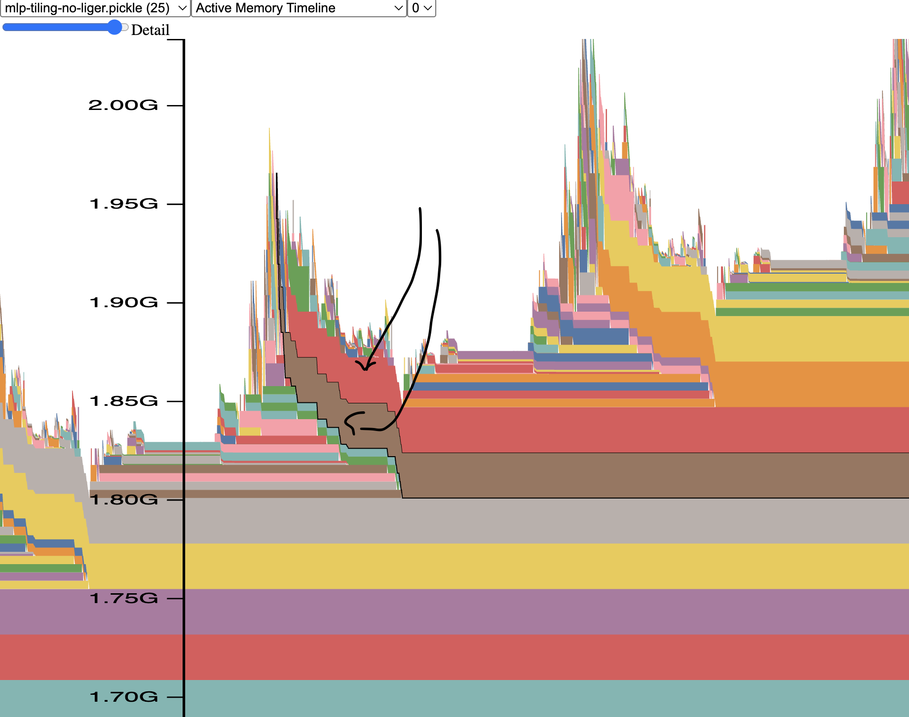
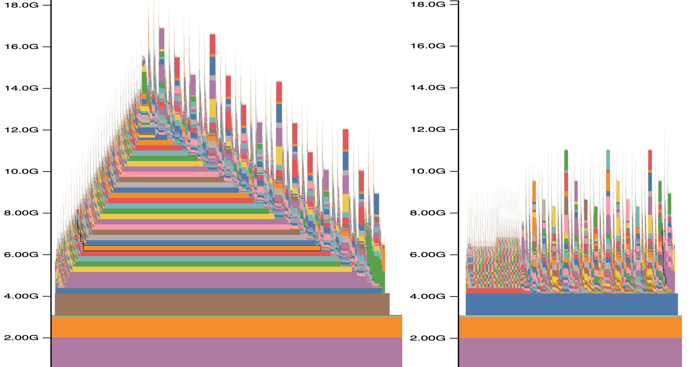

# Debugging PyTorch

Most of the PyTorch debug notes are in my other book [here](https://github.com/stas00/ml-engineering/blob/master/debug/pytorch.md).

## Speeding up debug of large models

When debugging PyTorch workflows, as explained in [using small payload](../methodology#2-small-payload) you'd normally try to use tiny random models (see [here how to get and create those](https://github.com/stas00/ml-engineering/blob/master/debug/make-tiny-models-tokenizers-datasets.md). But since some problems only appear at scale it's very likely you'd have to use the full-sized model, which may take many minutes to load and run until it gets to the point of interest, where problems appear.

Given the nature of ML model architectures, they typically use a sequence of identical layers that repeat one after another. Therefore, if a model has say 48 layers, you can shrink it to just 2 layers, which will dramatically speed up both the loading and moving in the code. Of course, the qualitative outcome will be bad, but we aren't concerned with quality if the workload hangs or breaks.

One way to accomplish the model shrinking at the layer dimension is to clone the modeling repo and change `config.json` to a new number of layers, e.g. in HF hub's models edit `config.json`:
```
- "num_hidden_layers": 48,
+ "num_hidden_layers": 2,
```
and now load the model from the local cloned path. When the model gets loaded you will get a massive warning of unused weights, but you can ignore that.

Alternatively you can change the modeling code and hardcode the number of layers in the model's `__init__`. For example, if we use `Qwen3MoePreTrainedModel`:

```
class Qwen3MoeModel(Qwen3MoePreTrainedModel):
    def __init__(self, config: Qwen3MoeConfig):
        super().__init__(config)
        # add this line to load only 2 layers
        config.num_hidden_layers = 2
```

This is an easier approach than tweaking `config.json` if you plan to try various models of the same architecture, as you'd only need to tweak the modeling code once and not change the model configs.

If you want to load the full model, but only run a few layers, then you can hack the loop over the layers in the model's `forward`. If the original code in `Qwen3MoeModel.forward` was:

```
for decoder_layer in self.layers[: self.config.num_hidden_layers]):
    hidden_states = decoder_layer(...)
```
you can change to:
```
KEEP_N_LAYERS = 2
for idx, decoder_layer in enumerate(self.layers[: self.config.num_hidden_layers]):
    # XXX: shortcut for much faster completion
    if idx+1 > KEEP_N_LAYERS: continue
    hidden_states = decoder_layer(...)
```

Now, let's say you work with a very long sequence length and full attention makes things too slow (because attention is quadratic in compute wrt sequence length). To get the memory allocation right you need to run it at least once (since all layers will use the same amount of memory). Same as with skipping layers, you can skip just attention runs. Let's say we run only attention in the last layer:

In attention `__init__` we set a few flags, let's use `Qwen3MoeAttention`:
```
    def __init__(self, config: Qwen3MoeConfig, layer_idx: int):
        super().__init__()
        self.skip_all_but_last_attention_debug_mode = True
        self.rotating_layer_counter = 0
```

and then in `Qwen3MoeAttention.forward`, we replace:
```
attn_output, attn_weights = attention_interface((self, query_states, ...)
```
(note the `...` - most args were trimmed for this exemplification), with:
```
import einops
if not self.skip_all_but_last_attention_debug_mode:
    attn_output, attn_weights = attention_interface(self, query_states, ...)
else:
    self.rotating_layer_counter = (self.rotating_layer_counter + 1) % self.num_hidden_layers
    # we detect the last layer by module counting since we know how many layers there are
    if self.rotating_layer_counter % self.num_hidden_layers == 0:
        attn_output, attn_weights = attention_interface(self, query_states, ...)
    else:
        # this feeds bogus data of the right shape connected to a graph - good enough for debug
        attn_output = einops.rearrange(query_states, "bs hc sl ... -> bs sl hcl ...")
        attn_weights = None
```
and install `pip install einops` for it to work.


## Memory usage

GPU memory is probably the most invaluable resource, often more important than the compute power and we always want more of it. So it's good to know how not to waste it.

The one error we all want to avoid is Out of Memory (aka OOM):
```
CUDA out of memory. Tried to allocate 15.41 GiB. GPU 3 has a total capacity of 79.10 GiB of which 15.40 GiB is free
```

### PyTorch memory profiler

PyTorch memory profiler is quite easy to use. It requires 2 stages.

Stage 1. Instrument and run the code under `torch.cuda.memory` profiler

```python
import torch
torch.cuda.memory._record_memory_history(max_entries=1e9)
# your tensor creation code goes here, e.g.:
t = torch.zeros(100,100, device="cuda")
torch.cuda.memory._dump_snapshot("/tmp/mem.pickle")
```

Here we just allocate a small tensor of zeros.

If you're on a multi-gpu setup you'd want to write a profile dump per rank to an individual file:
```python
rank = torch.distributed.get_rank() # assuming torch.dist has already been initialized
torch.cuda.memory._dump_snapshot(f"/tmp/mem-{rank}.pickle")
```
or just save one rank instead if everything is symmetical. The first time I missed this nuance and I was getting weird results, since I was hitting a race condition of different ranks writing to the same file, which looked non-corrupt when rendered but the outcome was a big mess.

For a largish code you would want to record as many memory allocation/free events as possible so I normally use a pretty large value like `max_entries=1e9` for the `_record_memory_history` call.

Stage 2. Render the saved profile information into a visual representation

At this stage you'd typically go to https://pytorch.org/memory_viz and drop the memory profile pickle file you generated in Stage 1 into the browser at that URL. The most useful feature there is the 'Active memory profile` drop-down menu.

To get a feeling for what it looks like, here is an example of a memory profile rendering for a memory leak I discovered while I was working on a tricky implementation of a [`TiledMLP` `torch.autograd.Function`](https://github.com/deepspeedai/DeepSpeed/blob/02da3732934efbf10b72e143758747386d45f724/deepspeed/runtime/sequence_parallel/ulysses_sp.py#L836).



You can see those brown- and red-coloured continous horizonontal bars (I pointed to those with black arrows). On the very left edge of those bars are the moments that created 2 large tensors during a single layer's `forward`, but you can see those 2 unlike other colored bars continue all the way into the right edge. The exact same story happen in the next spike, which is just the subsequent layer's memory allocations when it runs its `forward` - and you can see the yellow and orange bars that demonstrate the same leak, because it doesn't get cleared. So each layer's `forward` here leaks a few MBs of memory, which quickly adds up. A very small model has been used here, so that the absolute leak size was small, but once switched to a real model those MBs become GBs and we quickly run out of memory.

You can click on all those bars and the profiler will show you the traceback to the code that created the corresponding memory allocation. Since under the hood, PyTorch runs C++ CUDA code, unless you understand what happens there, it won't help you to understand the location of the leak in the code. But if you trace back up the trace into the python land, you will actually see references to functions that you'd be familiar with. For example, calls like `torch.zeros()`.

As long as you're in the `forward` function it's relatively easy to find where in the code leaks comes from. But if it's a `backward` it becomes much more complicated unless you're debugging a custom autograd function. Still it should give you enough information to be able to ask for help if you can't figure it out yourself. The best recourse in that situation is to try to reduce the code to the minimal size reproducible python script that others can reproduce the problem with and then ask at some place where PyTorch developers hang out - for example I find `#questions` at the PyTorch Slack workspace to be an invaluable resource. If you don't have access to that Slack workspace, fear not,  https://discuss.pytorch.org/ should work just as well. Even better, using the latter will help others to find answers to the same question down the road.

Besides profiling memory leaks, this functionality is also useful for showing how different implementations of the same algorithm use a different amount of gpu memory. For example, the following visualization I prepared for the [Arctic Long Sequence Training paper](https://arxiv.org/abs/2506.13996):



This visualization depicts a PyTorch memory profile over a single `forward`-`backward` iteration. Left: normal setup. Right: with activation checkpoint offloading to CPU enabled.

The left side visualization is very telling to how gpu memory is used in the `forward` and `backward` calls, you can see how the left side, which is about 1/3 of the plot, is the layer-by-layer `forward` calls, and the right side, which is the remaining 2/3 of the plot, is layer-by-layer `backward` calls. You can also see that `backward` takes 2x longer than `forward` because it has do to compute gradients wrt weights and inputs. You can also see that typically `forward` allocates a lot of memory, which `backward` then gradually releases, while also doing small allocations of its own.

The right side visualization shows how very different memory usage pattern is, if we don't store any intermediary tensors on the gpu and offload them to cpu memory. You can see the same `forward` and `backward` calls but now the memory plot is flat, so you can add many more layers and it'll still use the same amount of gpu memory, whereas the image on left shows that if there are too many layers one will run into OOM, as the hill will continue to climb. If you're curious, the big spikes during `backward` in both images are gradient reductions across gpus.

This shows that even if you don't suspect a memory leak in your code it might still be a good idea to run it through memory profiler and you might get ideas to how to reduce memory usage or at the very least you will have a better feel for what your code is doing with the gpu memory.

Additional resources:
- [Understanding GPU Memory 1: Visualizing All Allocations over Time](https://pytorch.org/blog/understanding-gpu-memory-1/)
- HF folks made an [improved rendering version](https://huggingface.co/spaces/Leiyre/memory-viz).


### Debugging CPU memory OOM

This one is often very tricky to debug especially when a compute node is shared with others and each user gets to enjoy only a slice of the available CPU memory.

Once Resident cpu memory (RSS in `top`) hits the preset limit the program will get killed. There is no nice OOM message like we get with CUDA running out of memory, but you just get a single message:

```
Killed
```

which is very difficult to notice. This is typically performed by an `oom-kill` via [cgroups](https://docs.kernel.org/admin-guide/cgroup-v2.html). The `SIGKILL` is not trapable and there is no way to analyse what happens.

note: Moreover in some situations, as in recent kubernetes implementations, the user gets kicked out from the job allocation, which makes it even more difficult to debug. [Kubernetes Silent Pod Killer](https://itnext.io/kubernetes-silent-pod-killer-104e7c8054d9). This k8s "feature" makes no sense to me.

In the world of ML, you're likely to encounter this issue if you're doing massive parallel data preprocessing or you do GPU offloading. But more often when you build python wheels for massive packages like Flash Attention 2.

### Strategic memory allocation tracing

While external memory profilers can be very useful, often having control over when you take a sample of GPU and CPU memory usage is needed. `see-mem-usage` debug util has been developed by the [Deepspeed project](https://github.com/deepspeedai/deepspeed) and I made some small tweaks to it:

[see-mem-usage.py](code/see-mem-usage.py)

You want to make sure `pip install nvidia-ml-py` is run once, so that the report includes not only the CUDA memory report but the total gpu memory usage, since CUDA memory allocator is not always used. e.g., NCCL memory allocations aren't visible by CUDA and thus aren't accounted for, but can consume GBs of gpu memory. The total memory usage identical to what `nvidia-smi` reports is the `NV` column in the report.

A critical nuance when tracing GPU memory usage is that if you released a python variable containing a tensor it doesn't necessarily mean the tensor gets immediately freed. Python's garbage collection is run on a schedule and thus it's critical to run `gc.collect()` after releasing critical large environment variables (while debugging!) and only then sampling memory usage, which is what this library does for you behind the scenes.

Needless to say you will not want to use this library in production, since the overhead of frequent `gc.collect` calls and nvlm sampling adds a non-trivial runtime overhead. So remember to flip `force=True` to `force=False` and then you can leave the debug code in your production code if desired.

So let's run a little program that allocates a tensor, copies it to cpu, frees it on gpu and then frees the cpu copy.

```python
    device = "cuda" if torch.cuda.is_available() else "cpu"
    see_memory_usage("before alloc", force=True)
    t1 = torch.zeros(100000,10000, device=device)
    t2 = torch.zeros(100000,10000, device=device)
    del t2
    see_memory_usage("after alloc", force=True)
    c1 = t1.cpu()
    see_memory_usage("after copy to cpu", force=True)
    del t1
    see_memory_usage("after freeing on gpu", force=True)
    del c1
    see_memory_usage("after freeing on cpu", force=True)

```

Let's look at the output. The above program is at the bottom of the `see-mem-usage.py` library)

```bash
$ python see-mem-usage.py
[0] mp: before alloc
[0] mp: MA 0.00 GB | Max_MA 0.00 GB | CA 0.00 GB | Max_CA 0.00 GB | NV 0.59 GB | CPU Virtual Memory:  used = 82.71 GB, percent = 4.1%
[0] mp: before alloc2
[0] mp: MA 0.00 GB | Max_MA 0.00 GB | CA 0.00 GB | Max_CA 0.00 GB | NV 0.59 GB | CPU Virtual Memory:  used = 82.71 GB, percent = 4.1%
[0] mp: after alloc
[0] mp: MA 3.73 GB | Max_MA 7.45 GB | CA 7.45 GB | Max_CA 7.45 GB | NV 8.65 GB | CPU Virtual Memory:  used = 82.82 GB, percent = 4.1%
[0] mp: after copy to cpu
[0] mp: MA 3.73 GB | Max_MA 3.73 GB | CA 7.45 GB | Max_CA 7.45 GB | NV 8.65 GB | CPU Virtual Memory:  used = 86.55 GB, percent = 4.3%
[0] mp: after freeing on gpu
[0] mp: MA 0.00 GB | Max_MA 3.73 GB | CA 7.45 GB | Max_CA 7.45 GB | NV 8.65 GB | CPU Virtual Memory:  used = 86.55 GB, percent = 4.3%
[0] mp: after freeing on cpu
[0] mp: MA 0.00 GB | Max_MA 0.00 GB | CA 7.45 GB | Max_CA 7.45 GB | NV 8.65 GB | CPU Virtual Memory:  used = 82.82 GB, percent = 4.1%
```

Legend:

- `MA`: `torch.cuda.memory_allocated()` - how much memory has been allocated at this moment
- `Max_MA`: `torch.cuda.max_memory_allocated()` - what was the peak memory usage so far (we also reset this counter after each run, so it will show the peak memory since the last call to `see_mem_usage`)
- `CA `: `torch.cuda.memory_reserved()`
- `Max_CA`: `torch.cuda.max_memory_reserved()`
- `NV`: current total memory usage like `nvidia-smi` report, which is almost always more than what's reported by torch.cuda (the `MA` column)
- `CPU Virtual Memory`: CPU stats - RSS and percentage of total cpu memory

Now that we know what each column stands for let's analyse the output of the program.

```
[0] mp: before alloc
[0] mp: MA 0.00 GB | Max_MA 0.00 GB | CA 0.00 GB | Max_CA 0.00 GB | NV 0.59 GB | CPU Virtual Memory:  used = 82.86 GB, percent = 4.1%
```

If you look at the `NV` columnn you can see the gpu was already using 0.59GB of memory, even though no tensor has been allocated yet. This is because CUDA loads compute kernels the first time you call `import torch` - note that `torch.cuda` is not reporting that! all its columns are zeros.

Then we execute:
```
    t1 = torch.zeros(100000,10000, device=device)
    t2 = torch.zeros(100000,10000, device=device)
    del t2
```
and the corresponding log around it is:

```
[0] mp: before alloc
[0] mp: MA 0.00 GB | Max_MA 0.00 GB | CA 0.00 GB | Max_CA 0.00 GB | NV 0.59 GB | CPU Virtual Memory:  used = 82.76 GB, percent = 4.1%
[0] mp: after alloc
[0] mp: MA 3.73 GB | Max_MA 7.45 GB | CA 7.45 GB | Max_CA 7.45 GB | NV 8.65 GB | CPU Virtual Memory:  used = 82.87 GB, percent = 4.1%
[0] mp: after copy to cpu
```

So we can that `MA` is half of `Max_MA` - because we had 2 tensors of the same size allocated and one of them freed. So the CUDA peak memory of 7.45GB is 2x larger than the the current CUDA memory usage. This is a very important momemnt. Often the software OOMs exactly during peak memory usage. For example, if some intermediary tensor isn't freed up fast enough it could cause OOM - and also see the earlier note about python garbage collection, there are rare situations where a well placed `gc.collect` call can save the day and prevent OOM.

The `CA` and `MaxCA` columns report cached memory, I often find those not very useful for memory debug purposes, I sometimes even add:

```
torch.cuda.empty_cache()
```

to prevent caching getting in the way of accounting, but this one is definitely going to slow things down. The snippet is in `see_memory_usage`, but commented out.

But caching will lead to `nvidia-smi` or the `NV` column in this report to reporting cached memory. In the last row of the report snippet above you can see that while `torch.cuda` reports only 3.73GB of the actual memory usage, `NV` is 8.65GB, because some of the memory got cached, but it doesn't check out.

`8.65-7.45=1.2` GB, whereas the previous `see_mem_usage` before tensor allocation reported `NV` 0.59GB, in other words some other gpu memory allocations that `torch.cuda` hasn't accounted for have happened and we have no idea what they are! Watch that delta between what CUDA columns and the NV column, sometimes you might find many GBs are unaccounted for.

What happened here is most likely PyTorch `torch.zero` call loaded some additional CUDA kernels which took another half GB of GPU memory (again unaccounted for). `torch.distributed` with NCCL is another large source of "lost" GPU memory.

Next, we copy one tensor to cpu memory:
```
    c1 = t1.cpu()
```
which gives us:
```
[0] mp: after alloc
[0] mp: MA 3.73 GB | Max_MA 7.45 GB | CA 7.45 GB | Max_CA 7.45 GB | NV 8.65 GB | CPU Virtual Memory:  used = 82.82 GB, percent = 4.1%
[0] mp: after copy to cpu
[0] mp: MA 3.73 GB | Max_MA 3.73 GB | CA 7.45 GB | Max_CA 7.45 GB | NV 8.65 GB | CPU Virtual Memory:  used = 86.55 GB, percent = 4.3%
```
we see the `torch.cuda` and NV counters remain the same but CPU memory counters have gone up.

Do note that the CPU mmeory report here isn't as informative as gpu memory reports, but what matters here is the delta wrt previous call.

When I want to debug just GPU memory I often remove the cpu memory reports altogether.

One other thing to observe here is that `MA 3.73 GB | Max_MA 3.73 GB` - current and peak memory usage are the same, since there were no memory allocations or freeing on gpu at this step.

Mext we delete our second tensor on CUDA:

```
[0] mp: after copy to cpu
[0] mp: MA 3.73 GB | Max_MA 3.73 GB | CA 7.45 GB | Max_CA 7.45 GB | NV 8.65 GB | CPU Virtual Memory:  used = 86.55 GB, percent = 4.3%
[0] mp: after freeing on gpu
[0] mp: MA 0.00 GB | Max_MA 3.73 GB | CA 7.45 GB | Max_CA 7.45 GB | NV 8.65 GB | CPU Virtual Memory:  used = 86.55 GB, percent = 4.3%
```

and we see that `MA` has gone to 0, which is what we would expect, CUDA no longer has any active tensors. Note that the peak memory isn't zero, since there was exactly the size of that tensor allocation since the last time that counter was reset in `see_mem_usage` call.

Finally we free the tensor on cpu:

```
[0] mp: before alloc
[0] mp: MA 0.00 GB | Max_MA 0.00 GB | CA 0.00 GB | Max_CA 0.00 GB | NV 0.59 GB | CPU Virtual Memory:  used = 82.71 GB, percent = 4.1%
[0] mp: after freeing on gpu
[0] mp: MA 0.00 GB | Max_MA 3.73 GB | CA 7.45 GB | Max_CA 7.45 GB | NV 8.65 GB | CPU Virtual Memory:  used = 86.55 GB, percent = 4.3%
[0] mp: after freeing on cpu
[0] mp: MA 0.00 GB | Max_MA 0.00 GB | CA 7.45 GB | Max_CA 7.45 GB | NV 8.65 GB | CPU Virtual Memory:  used = 82.82 GB, percent = 4.1%
```

we can see that CPU memory report went back to numbers which are very close to the very first report, so we can see more or less all memory has been released on cpu.

The CUDA memory caches are still there as can be seen from `CA` and `Max_CA` columns, and `NV` reflects that plus some other non-CUDA allocation as discussed earlier.

If at the very end we add:
```
torch.cuda.empty_cache()
see_memory_usage("after empty cache", force=True)
```

we would see:
```
[0] mp: after empty cache
[0] mp: MA 0.00 GB | Max_MA 0.00 GB | CA 0.00 GB | Max_CA 7.45 GB | NV 1.19 GB | CPU Virtual Memory:  used = 82.8 GB, percent = 4.1%
```

Note how the `CA` columns is now 0, `Max_CA` column is still non-zero because it was still reporting peak, if we call `see_memory_usage` yet another time, it'd go to 0 as well.

But the interesting other number here is `NV 1.19 GB` which tells us that there was 1.2GB of memory allocated outside of the perview of `torch.cuda`. When I try to debug memory leaks that are inside PyTorch that when I enable `torch.cuda.empty_cache()` inside `see_memory_usage` because then it reports the delta for me and I don't need to do any math.

You can't imagine how often I use this debug utility in my day-to-day work.  Every so often I sprinkle these calls around the strategic places I suspect and start mapping out block by block and then narrowing down to the suspect areas. Foe example, one useful use case is to run this report before `forward`, `backward` and `step` and observe if each training iteration leaks a bit of memory and where:

```
    see_memory_usage("before fwd", force=True)
    output = model(**inputs)
    see_memory_usage("before bwd", force=True)
    output.loss.backward()
    see_memory_usage("before step", force=True)
    optimizer.step()
    see_memory_usage("after step", force=True)
```

For example, here is how I found a memory leak in `all_gather_object`, which you can see from this [Issue](https://github.com/pytorch/pytorch/issues/150798). And there were several other similar leaks in PyTorch I discovered using this tool - all have been fixed since then. But more often, of course, the memory leaks are in my code ;)