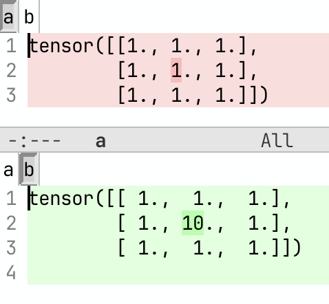

# Debugging PyTorch

A lot of the PyTorch debug notes are in my Machine Learning Engineering online book [here](https://github.com/stas00/ml-engineering/blob/master/debug/pytorch.md).


## Memory usage

GPU memory is probably the most invaluable resource, often more important than the compute power and we always want more of it. So it's good to know how not to waste it.

The one error we all want to avoid is Out of Memory (aka OOM):
```
CUDA out of memory. Tried to allocate 15.41 GiB. GPU 3 has a total capacity of 79.10 GiB of which 15.40 GiB is free
```

### PyTorch memory profiler

PyTorch memory profiler is quite easy to use. It requires 2 stages.

Stage 1. Instrument and run the code under `torch.cuda.memory` profiler

```python
import torch
torch.cuda.memory._record_memory_history(max_entries=1e9)
# your tensor creation code goes here, e.g.:
t = torch.zeros(100,100, device="cuda")
torch.cuda.memory._dump_snapshot("/tmp/mem.pickle")
```

Here we just allocate a small tensor of zeros.

If you're on a multi-gpu setup you'd want to write a profile dump per rank to an individual file:
```python
rank = torch.distributed.get_rank() # assuming torch.dist has already been initialized
torch.cuda.memory._dump_snapshot(f"/tmp/mem-{rank}.pickle")
```
or just save one rank instead if everything is symmetrical. The first time I missed this nuance and I was getting weird results, since I was hitting a race condition of different ranks writing to the same file, which looked non-corrupt when rendered but the outcome was a big mess.

For a largish code you would want to record as many memory allocation/free events as possible so I normally use a pretty large value like `max_entries=1e9` for the `_record_memory_history` call.

Stage 2. Render the saved profile information into a visual representation

At this stage you'd typically go to https://pytorch.org/memory_viz and drop the memory profile pickle file you generated in Stage 1 into the browser at that URL. The most useful feature there is the 'Active memory profile` drop-down menu.

To get a feeling for what it looks like, here is an example of a memory profile rendering for a memory leak I discovered while I was working on a tricky implementation of a [`TiledMLP` `torch.autograd.Function`](https://github.com/deepspeedai/DeepSpeed/blob/02da3732934efbf10b72e143758747386d45f724/deepspeed/runtime/sequence_parallel/ulysses_sp.py#L836).


You can see those brown- and red-coloured continuous horizontal bars (I pointed to those with black arrows). On the very left edge of those bars are the moments that created 2 large tensors during a single layer's `forward`, but you can see those 2 unlike other colored bars continue all the way into the right edge. The exact same story happen in the next spike, which is just the subsequent layer's memory allocations when it runs its `forward` - and you can see the yellow and orange bars that demonstrate the same leak, because it doesn't get cleared. So each layer's `forward` here leaks a few MBs of memory, which quickly adds up. A very small model has been used here, so that the absolute leak size was small, but once switched to a real model those MBs become GBs and we quickly run out of memory.

You can click on all those bars and the profiler will show you the traceback to the code that created the corresponding memory allocation. Since under the hood, PyTorch runs C++ CUDA code, unless you understand what happens there, it won't help you to understand the location of the leak in the code. But if you trace back up the trace into the python land, you will actually see references to functions that you'd be familiar with. For example, calls like `torch.zeros()`.

As long as you're in the `forward` function it's relatively easy to find where in the code leaks comes from. But if it's a `backward` it becomes much more complicated unless you're debugging a custom autograd function. Still it should give you enough information to be able to ask for help if you can't figure it out yourself. The best recourse in that situation is to try to reduce the code to the minimal size reproducible python script that others can reproduce the problem with and then ask at some place where PyTorch developers hang out - for example I find `#questions` at the PyTorch Slack workspace to be an invaluable resource. If you don't have access to that Slack workspace, fear not,  https://discuss.pytorch.org/ should work just as well. Even better, using the latter will help others to find answers to the same question down the road.

Besides profiling memory leaks, this functionality is also useful for showing how different implementations of the same algorithm use a different amount of gpu memory. For example, the following visualization I prepared for the [Arctic Long Sequence Training paper](https://arxiv.org/abs/2506.13996):


This visualization depicts a PyTorch memory profile over a single `forward`-`backward` iteration. Left: normal setup. Right: with activation checkpoint offloading to CPU enabled.

The left side visualization is very telling to how gpu memory is used in the `forward` and `backward` calls, you can see how the left side, which is about 1/3 of the plot, is the layer-by-layer `forward` calls, and the right side, which is the remaining 2/3 of the plot, is layer-by-layer `backward` calls. You can also see that `backward` takes 2x longer than `forward` because it has do to compute gradients wrt weights and inputs. You can also see that typically `forward` allocates a lot of memory, which `backward` then gradually releases, while also doing small allocations of its own.

The right side visualization shows how very different memory usage pattern is, if we don't store any intermediary tensors on the gpu and offload them to cpu memory. You can see the same `forward` and `backward` calls but now the memory plot is flat, so you can add many more layers and it'll still use the same amount of gpu memory, whereas the image on left shows that if there are too many layers one will run into OOM, as the hill will continue to climb. If you're curious, the big spikes during `backward` in both images are gradient reductions across gpus.

This shows that even if you don't suspect a memory leak in your code it might still be a good idea to run it through memory profiler and you might get ideas to how to reduce memory usage or at the very least you will have a better feel for what your code is doing with the gpu memory.

Additional important notes:
- Try to limit the profiler dump to just a few iterations, otherwise when you try to render the results in the browser it's likely to crash. You always want at least 2 iterations since the first one is always an outlier. I usually do 3 iterations.

Additional resources:
- [Understanding GPU Memory 1: Visualizing All Allocations over Time](https://pytorch.org/blog/understanding-gpu-memory-1/)
- HF folks made an [improved rendering version](https://huggingface.co/spaces/Leiyre/memory-viz).


### Strategic memory allocation tracing

While external memory profilers can be very useful, often having control over when you take a sample of GPU and CPU memory usage is needed. `see-mem-usage` debug util has been developed by the [Deepspeed project](https://github.com/deepspeedai/deepspeed) and I made some small tweaks to it:

[see-mem-usage.py](code/see-mem-usage.py)

You want to make sure `pip install nvidia-ml-py` is run once, so that the report includes not only the CUDA memory report but the total gpu memory usage, since CUDA memory allocator is not always used. e.g., NCCL memory allocations aren't visible by CUDA and thus aren't accounted for, but can consume GBs of gpu memory. The total memory usage identical to what `nvidia-smi` reports is the `NV` column in the report.

A critical nuance when tracing GPU memory usage is that if you released a python variable containing a tensor it doesn't necessarily mean the tensor gets immediately freed. Python's garbage collection is run on a schedule and thus it's critical to run `gc.collect()` after releasing critical large environment variables (while debugging!) and only then sampling memory usage, which is what this library does for you behind the scenes.

Needless to say you will not want to use this library in production, since the overhead of frequent `gc.collect` calls and nvml sampling adds a non-trivial runtime overhead. So remember to flip `force=True` to `force=False` and then you can leave the debug code in your production code if desired.

So let's run a little program that allocates a tensor, copies it to cpu, frees it on gpu and then frees the cpu copy.

```python
    device = "cuda" if torch.cuda.is_available() else "cpu"
    see_memory_usage("before alloc", force=True)
    t1 = torch.zeros(100000,10000, device=device)
    t2 = torch.zeros(100000,10000, device=device)
    del t2
    see_memory_usage("after alloc", force=True)
    c1 = t1.cpu()
    see_memory_usage("after copy to cpu", force=True)
    del t1
    see_memory_usage("after freeing on gpu", force=True)
    del c1
    see_memory_usage("after freeing on cpu", force=True)

```

Let's look at the output. The above program is at the bottom of the `see-mem-usage.py` library)

```bash
$ python see-mem-usage.py
[0] mp: before alloc
[0] mp: MA 0.00 GB | Max_MA 0.00 GB | CA 0.00 GB | Max_CA 0.00 GB | NV 0.59 GB | CPU Virtual Memory:  used = 82.71 GB, percent = 4.1%
[0] mp: before alloc2
[0] mp: MA 0.00 GB | Max_MA 0.00 GB | CA 0.00 GB | Max_CA 0.00 GB | NV 0.59 GB | CPU Virtual Memory:  used = 82.71 GB, percent = 4.1%
[0] mp: after alloc
[0] mp: MA 3.73 GB | Max_MA 7.45 GB | CA 7.45 GB | Max_CA 7.45 GB | NV 8.65 GB | CPU Virtual Memory:  used = 82.82 GB, percent = 4.1%
[0] mp: after copy to cpu
[0] mp: MA 3.73 GB | Max_MA 3.73 GB | CA 7.45 GB | Max_CA 7.45 GB | NV 8.65 GB | CPU Virtual Memory:  used = 86.55 GB, percent = 4.3%
[0] mp: after freeing on gpu
[0] mp: MA 0.00 GB | Max_MA 3.73 GB | CA 7.45 GB | Max_CA 7.45 GB | NV 8.65 GB | CPU Virtual Memory:  used = 86.55 GB, percent = 4.3%
[0] mp: after freeing on cpu
[0] mp: MA 0.00 GB | Max_MA 0.00 GB | CA 7.45 GB | Max_CA 7.45 GB | NV 8.65 GB | CPU Virtual Memory:  used = 82.82 GB, percent = 4.1%
```

Legend:

- `MA`: `torch.cuda.memory_allocated()` - how much memory has been allocated at this moment
- `Max_MA`: `torch.cuda.max_memory_allocated()` - what was the peak memory usage so far (we also reset this counter after each run, so it will show the peak memory since the last call to `see_mem_usage`)
- `CA `: `torch.cuda.memory_reserved()`
- `Max_CA`: `torch.cuda.max_memory_reserved()`
- `NV`: current total memory usage like `nvidia-smi` report, which is almost always more than what's reported by torch.cuda (the `MA` column)
- `CPU Virtual Memory`: CPU stats - RSS and percentage of total cpu memory

Now that we know what each column stands for let's analyze the output of the program.

```
[0] mp: before alloc
[0] mp: MA 0.00 GB | Max_MA 0.00 GB | CA 0.00 GB | Max_CA 0.00 GB | NV 0.59 GB | CPU Virtual Memory:  used = 82.86 GB, percent = 4.1%
```

If you look at the `NV` column you can see the gpu was already using 0.59GB of memory, even though no tensor has been allocated yet. This is because CUDA loads compute kernels the first time you call `import torch` - note that `torch.cuda` is not reporting that! all its columns are zeros.

Then we execute:
```
    t1 = torch.zeros(100000,10000, device=device)
    t2 = torch.zeros(100000,10000, device=device)
    del t2
```
and the corresponding log around it is:

```
[0] mp: before alloc
[0] mp: MA 0.00 GB | Max_MA 0.00 GB | CA 0.00 GB | Max_CA 0.00 GB | NV 0.59 GB | CPU Virtual Memory:  used = 82.76 GB, percent = 4.1%
[0] mp: after alloc
[0] mp: MA 3.73 GB | Max_MA 7.45 GB | CA 7.45 GB | Max_CA 7.45 GB | NV 8.65 GB | CPU Virtual Memory:  used = 82.87 GB, percent = 4.1%
[0] mp: after copy to cpu
```

So we can that `MA` is half of `Max_MA` - because we had 2 tensors of the same size allocated and one of them freed. So the CUDA peak memory of 7.45GB is 2x larger than the the current CUDA memory usage. This is a very important moment. Often the software OOMs exactly during peak memory usage. For example, if some intermediary tensor isn't freed up fast enough it could cause OOM - and also see the earlier note about python garbage collection, there are rare situations where a well placed `gc.collect` call can save the day and prevent OOM.

The `CA` and `MaxCA` columns report cached memory, I often find those not very useful for memory debug purposes, I sometimes even add:

```
torch.cuda.empty_cache()
```

to prevent caching getting in the way of accounting, but this one is definitely going to slow things down. The snippet is in `see_memory_usage`, but commented out.

But caching will lead to `nvidia-smi` or the `NV` column in this report to reporting cached memory. In the last row of the report snippet above you can see that while `torch.cuda` reports only 3.73GB of the actual memory usage, `NV` is 8.65GB, because some of the memory got cached, but it doesn't check out.

`8.65-7.45=1.2` GB, whereas the previous `see_mem_usage` before tensor allocation reported `NV` 0.59GB, in other words some other gpu memory allocations that `torch.cuda` hasn't accounted for have happened and we have no idea what they are! Watch that delta between what CUDA columns and the NV column, sometimes you might find many GBs are unaccounted for.

What happened here is most likely PyTorch `torch.zero` call loaded some additional CUDA kernels which took another half GB of GPU memory (again unaccounted for). `torch.distributed` with NCCL is another large source of "lost" GPU memory.

Next, we copy one tensor to cpu memory:
```
    c1 = t1.cpu()
```
which gives us:
```
[0] mp: after alloc
[0] mp: MA 3.73 GB | Max_MA 7.45 GB | CA 7.45 GB | Max_CA 7.45 GB | NV 8.65 GB | CPU Virtual Memory:  used = 82.82 GB, percent = 4.1%
[0] mp: after copy to cpu
[0] mp: MA 3.73 GB | Max_MA 3.73 GB | CA 7.45 GB | Max_CA 7.45 GB | NV 8.65 GB | CPU Virtual Memory:  used = 86.55 GB, percent = 4.3%
```
we see the `torch.cuda` and NV counters remain the same but CPU memory counters have gone up.

Do note that the CPU memory report here isn't as informative as gpu memory reports, but what matters here is the delta wrt previous call.

When I want to debug just GPU memory I often remove the cpu memory reports altogether.

One other thing to observe here is that `MA 3.73 GB | Max_MA 3.73 GB` - current and peak memory usage are the same, since there were no memory allocations or freeing on gpu at this step.

Next we delete our second tensor on CUDA:

```
[0] mp: after copy to cpu
[0] mp: MA 3.73 GB | Max_MA 3.73 GB | CA 7.45 GB | Max_CA 7.45 GB | NV 8.65 GB | CPU Virtual Memory:  used = 86.55 GB, percent = 4.3%
[0] mp: after freeing on gpu
[0] mp: MA 0.00 GB | Max_MA 3.73 GB | CA 7.45 GB | Max_CA 7.45 GB | NV 8.65 GB | CPU Virtual Memory:  used = 86.55 GB, percent = 4.3%
```

and we see that `MA` has gone to 0, which is what we would expect, CUDA no longer has any active tensors. Note that the peak memory isn't zero, since there was exactly the size of that tensor allocation since the last time that counter was reset in `see_mem_usage` call.

Finally we free the tensor on cpu:

```
[0] mp: before alloc
[0] mp: MA 0.00 GB | Max_MA 0.00 GB | CA 0.00 GB | Max_CA 0.00 GB | NV 0.59 GB | CPU Virtual Memory:  used = 82.71 GB, percent = 4.1%
[0] mp: after freeing on gpu
[0] mp: MA 0.00 GB | Max_MA 3.73 GB | CA 7.45 GB | Max_CA 7.45 GB | NV 8.65 GB | CPU Virtual Memory:  used = 86.55 GB, percent = 4.3%
[0] mp: after freeing on cpu
[0] mp: MA 0.00 GB | Max_MA 0.00 GB | CA 7.45 GB | Max_CA 7.45 GB | NV 8.65 GB | CPU Virtual Memory:  used = 82.82 GB, percent = 4.1%
```

we can see that CPU memory report went back to numbers which are very close to the very first report, so we can see more or less all memory has been released on cpu.

The CUDA memory caches are still there as can be seen from `CA` and `Max_CA` columns, and `NV` reflects that plus some other non-CUDA allocation as discussed earlier.

If at the very end we add:
```
torch.cuda.empty_cache()
see_memory_usage("after empty cache", force=True)
```

we would see:
```
[0] mp: after empty cache
[0] mp: MA 0.00 GB | Max_MA 0.00 GB | CA 0.00 GB | Max_CA 7.45 GB | NV 1.19 GB | CPU Virtual Memory:  used = 82.8 GB, percent = 4.1%
```

Note how the `CA` columns is now 0, `Max_CA` column is still non-zero because it was still reporting peak, if we call `see_memory_usage` yet another time, it'd go to 0 as well.

But the interesting other number here is `NV 1.19 GB` which tells us that there was 1.2GB of memory allocated outside of the purview of `torch.cuda`. When I try to debug memory leaks that are inside PyTorch that when I enable `torch.cuda.empty_cache()` inside `see_memory_usage` because then it reports the delta for me and I don't need to do any math.

You can't imagine how often I use this debug utility in my day-to-day work.  Every so often I sprinkle these calls around the strategic places I suspect and start mapping out block by block and then narrowing down to the suspect areas. Foe example, one useful use case is to run this report before `forward`, `backward` and `step` and observe if each training iteration leaks a bit of memory and where:

```
    see_memory_usage("before fwd", force=True)
    output = model(**inputs)
    see_memory_usage("before bwd", force=True)
    output.loss.backward()
    see_memory_usage("before step", force=True)
    optimizer.step()
    see_memory_usage("after step", force=True)
```

For example, here is how I found a memory leak in `all_gather_object`, which you can see from this [Issue](https://github.com/pytorch/pytorch/issues/150798). And there were several other similar leaks in PyTorch I discovered using this tool - all have been fixed since then. But more often, of course, the memory leaks are in my code ;)

### CPU Memory

#### Debugging CPU memory OOM

This one is often very tricky to debug especially when a compute node is shared with others and each user gets to enjoy only a slice of the available CPU memory.

Once Resident cpu memory (RSS in `top`) hits the preset limit the program will get killed. There is no nice OOM message like we get with CUDA running out of memory, but you just get a single message:

```
Killed
```

which is very difficult to notice. This is typically performed by an `oom-kill` via [cgroups](https://docs.kernel.org/admin-guide/cgroup-v2.html). The `SIGKILL` is not trappable and there is no way to analyze what happens.

note: Moreover in some situations, as in recent kubernetes implementations, the user gets kicked out from the job allocation, which makes it even more difficult to debug. [Kubernetes Silent Pod Killer](https://itnext.io/kubernetes-silent-pod-killer-104e7c8054d9). This k8s "feature" makes no sense to me.

In the world of ML, you're likely to encounter this issue if you're doing massive parallel data preprocessing or you do GPU memory offloading to CPU memory. But more often when you build python wheels for massive packages like Flash Attention 2 w/o defining `MAX_JOBS` to be something quite small.

#### Getting program's CPU peak memory usage

One way was discussed in [Strategic memory allocation tracing](#strategic-memory-allocation-tracing) where you inject `see_memory_usage` during the program execution, but that's invasive and is not always easily doable, especially what if it's not a Python program that is causing the problem. Besides it doesn't tell you the actual CPU peak memory usage, only GPU peak memory usage.

So let's look at tools that report CPU peak memory usage, w/o needing to use full blown memory profiler.

##### /usr/bin/time

So the first program we look at is `/usr/bin/time`. Do not confuse it with the Bash's built-in `time`, which only reports runtime stats. Other shells beside Bash may have the built-in version as well. 

Let's run an example:

```bash
$ /usr/bin/time -v python -c "import torch"
        Command being timed: "python -c import torch"
        User time (seconds): 8.12
        System time (seconds): 0.24
        Percent of CPU this job got: 629%
        Elapsed (wall clock) time (h:mm:ss or m:ss): 0:01.33
        Average shared text size (kbytes): 0
        Average unshared data size (kbytes): 0
        Average stack size (kbytes): 0
        Average total size (kbytes): 0
        Maximum resident set size (kbytes): 640688
        Average resident set size (kbytes): 0
        Major (requiring I/O) page faults: 3
        Minor (reclaiming a frame) page faults: 75005
        Voluntary context switches: 489
        Involuntary context switches: 19
        Swaps: 0
        File system inputs: 0
        File system outputs: 8
        Socket messages sent: 0
        Socket messages received: 0
        Signals delivered: 0
        Page size (bytes): 4096
        Exit status: 0
```

While you can see that it does provide the same measurements as Bash's `time`:
```
        User time (seconds): 8.12
        System time (seconds): 0.24
        Elapsed (wall clock) time (h:mm:ss or m:ss): 0:01.33
```

What we want this time is this line:
```
        Maximum resident set size (kbytes): 640688
```
This gives us the peak memory used by the program, which is the highest amount of CPU memory the program used at any given point of its run. So if you measured your program needing let's say 200GB of CPU RAM and then you try to run it elsewhere where you only have 132GB of CPU memory, it'll not work (most likely it will get killed with [cpu-oom](#debugging-cpu-memory-oom) if cgroups are configured).

Note: when it comes to running out of CPU memory regardless of which memory usage reporting tool you use - typically what you want to track is the Resident Set Size metric, which is also known as RSS (e.g., it's one of the column names in the output of `top`). There are many other metrics, but those are usually not useful for this particular need.

As I'm writing this I have this problem where I'm trying to fit a huge model into a given number of GPUs and I'm forced to offload some of the model parameters to CPU memory since I can't fit them all into GPU memory, but I'm also running out of CPU memory. So what I do is I scale down the setup to remove half the layers of the model I try to use to measure the memory footprint and then I should be able to extrapolate the required memory for the full model. Of course, the other way is to do math, to calculate how much memory each tensor consumes, but often it's quicker to just measure usage empirically since math is often insufficient as some components get missed in the calculations. Or potentially you could get more CPU memory ;)

Observation: recently each GPU generation has been getting a sizeable increase in their memory size, however for some reason CSPs continue giving the same amount of CPU memory per compute node as they did with older GPUS with less memory, which leads to multiple problems and limitations. If you're a CSP reading this please consider future nodes to have at least the same amount of CPU memory as the total GPU memory of the node and then some - at least double or triple would be the best. Thank you!

If all you care about is the CPU peak memory report for the program you launched, you can use the ` -f '%M'` flag:

```bash
$ /usr/bin/time -f '%M' python -c "import torch"
640684
```
Now you can, for example, feed this number to some other program - say, you want to get the peak memory usage in a human readable format:
```bash
$ /usr/bin/time -f '%M' python -c "import torch" |& perl -ne 'chomp; printf "%0.2fGiB\n", $_/2**20'
0.61GiB
```

You can see that it about matched "Maximum resident set size" from before.

Note: the Unix memory measurements are often imprecise, because the memory management is very complex, so if you re-run this example again and again you will see slightly different results.

Now before we can use this as a reliable measurement tool let's check if the reported RSS memory usage checks out:

```bash
/usr/bin/time -f '%M' python -c "import torch"
640704
$ /usr/bin/time -f '%M' python -c "import torch; t=torch.zeros(2**14,2**14)"
1549504
$ /usr/bin/time -f '%M' python -c "import torch; t=torch.zeros(2**14,2**15)"
2588624
```

The first run is to measure the peak memory that was used to run `import torch`, which amounts to ~625MiB (`640704 / 2**10`).

Then the second run gives us the same plus memory that was needed to allocate a tensor of `2**14` by `2**14` in fp32 (default `torch` `dtype`) - so the expected additional memory usage is `2**14*2**14*4 = 1073741824` (fp32 `dtype` needs 4 bytes per element) or 1024MiB (`1073741824/2**20`). So let's compare the difference: `(1549504 - 640704) / 2**10` => 887.5GiB, so the reported memory came quite short of what we may have expected.

The third run is expected to have used a double of the additional memory used by the 2nd run, since we now allocated a 2x larger tensor of shape `2**14` by `2**15` - following the same math, that tensor would need 2048MiB of additional CPU memory. And the difference is `(2588624 - 640704) / 2**10` => 1902MiB so we are again short by about the same amount as the second run vs the first one.

However, if we compare the difference in the reported memory used between the second and the third run: `(2588624- 1549504) / 2**10` => 1014 MiB it now does check out very closely, since the expected memory difference was 1024MiB.

So what's going on here? What is being measured is the peak memory usage, so when we fire off `import torch` it allocates some memory, but also releases some, so when we add additional commands, their memory allocation will use some of the memory freed when `import torch` finished its run. So now you understand that comparing peak memory usage can be tricky if some memory get released, after being allocated.

Thus this tool is always useful to tell you how much memory was used at the highest point, but it can be tricky comparing memory usages of program variations.

Now the next question you're likely to ask is what if you have a launcher that spawns other sub-processes. Will it measure the peak memory usage of those sub-processes as well? Usually it does, but I think I have seen situations when it didn't. So let's spawn a sub-process which will run the same `import torch`:

```bash
$ /usr/bin/time -f '%M' sh -c 'python -c "import torch" & wait'
640744
$ /usr/bin/time -f '%M' python -c "import torch"
640836
```
We get a very similar report with and without a sub-process.

If I'm not mistaken it only follows the immediate child process, and not further, since if I use a launcher that calls another launcher which only then runs PyTorch processes I get a lot less memory reported. 

##### cgmemtime

[`cgmemtime`](https://github.com/gsauthof/cgmemtime) is a little gem of a C program that uses cgroups v2 to measure the peak CPU memory usage of a process and all of its descendants no matter how many generations follow it. 

It's super easy to build:
```bash
git clone https://github.com/gsauthof/cgmemtime
cd cgmemtime
make
```
Now copy the binary to some folder that in your `$PATH` (hint: run `echo $PATH` to see the options) and you can start using it.

```bash
$ cgmemtime python -c "import torch"

user:   0.856 s
sys:    0.101 s
wall:   0.989 s
child_RSS_high:     389572 KiB
group_mem_high:     209240 KiB

$ cgmemtime sh -c 'python -c "import torch" & wait'

user:   0.875 s
sys:    0.085 s
wall:   0.961 s
child_RSS_high:     389416 KiB
group_mem_high:     206520 KiB
```

As you can see it reports both the time and the peak memory usage.

Let's compare with `/usr/bin/time`:
```
$ /usr/bin/time -f '%M' sh -c 'python -c "import torch" & wait'
389748
```
It's almost identical `389416` vs `389748` - as mentioned elsewhere Linux CPU memory reporting is a very fluid thing and you're very likely to get slightly different reporting running the same command.

Note: Always recalibrate your tools before making comparisons. You will see different numbers in different sections of the book for the same commands since it's likely they were run at different times with different versions on different systems.

As of this writing most Unix systems have moved to cgroups v2, but it's possible to still find some older distributions that use cgroups v1. If that's the case look at older versions of `cgmemtime` since originally it was written for cgroups v1.

request: I'm yet to figure out how to make it work on a k8s pod, probably has something to do with the container not being configured properly to allow custom cgroups groups. If you know what needs to be done please share the solution.

#####


## Debugging Tensors

When developing software or dealing with some bugs during training or inference, or writing unit tests we often need to investigate tensors - their data, their attributes or both. In the following sections we are going to dive into the more efficient ways of doing this work.

### Many ways to dump tensor's values

Sometimes it's just enough to print the contents of the tensor to do some visual comparisons. What gets dumped can be controlled via `torch.set_printoptions`. Here are the most useful config options with annotation:

```python
torch.set_printoptions(
    threshold=100000000, # print all data (without ... skipping) - can be huge!
    sci_mode=False,      # print all data on the same scale of 1 (this disables scientific notation)
    precision=6,         # print X decimal points for floats (default 4)
    edgeitems=5,         # when the data is large and skipped, control how many entries are printed on each edge
    linewidth=120,       # redefine linewidth for when lines are \n-wrapped in printout (default 80)
                         # if threshold is defined, matrix printing will ignore this setting
    profile="full",      # printing defaults: "default", "short", "full"
)
```

```bash
$ python -c "import torch; t = torch.rand(100,100); print(t)"
tensor([[0.5171, 0.5535, 0.4281,  ..., 0.3363, 0.4250, 0.4631],
        [0.0597, 0.0126, 0.8424,  ..., 0.2475, 0.6926, 0.1892],
        [0.3671, 0.1032, 0.5224,  ..., 0.5822, 0.1384, 0.2008],
        ...,
        [0.1887, 0.9825, 0.8571,  ..., 0.9336, 0.5340, 0.6141],
        [0.0550, 0.9550, 0.4814,  ..., 0.7614, 0.0469, 0.7668],
        [0.3372, 0.4856, 0.9879,  ..., 0.8719, 0.7916, 0.1137]])
```

Sometimes the default 4 decimal places isn't enough, so we can ask for 6 with `precision=6`:

```bash
$ python -c "import torch; t = torch.rand(100,100); torch.set_printoptions(sci_mode=True); print(t)"
tensor([[5.7340e-01, 6.1205e-02, 5.5568e-01,  ..., 9.7872e-01, 6.3079e-01, 1.4958e-01],
        [6.5187e-01, 7.1725e-01, 7.4311e-01,  ..., 1.6829e-01, 2.9124e-01, 9.6725e-01],
        [2.0276e-01, 7.1093e-01, 1.5570e-01,  ..., 8.5468e-01, 3.3631e-02, 7.2699e-01],
        ...,
        [1.3556e-01, 4.1345e-02, 1.1752e-01,  ..., 5.0029e-01, 9.4572e-01, 1.4204e-01],
        [8.9816e-01, 1.4840e-01, 7.5320e-01,  ..., 2.6070e-01, 8.3193e-01, 9.8864e-01],
        [2.9861e-01, 8.4406e-01, 6.4992e-01,  ..., 2.2556e-01, 7.4448e-01, 1.7672e-01]])
```

I often find that when the tensor values are wildly different, forcing the scientific format helps with comparing 2 tensors:

```bash
$ python -c "import torch; t = torch.rand(100,100); torch.set_printoptions(precision=6); print(t)"
tensor([[5.7340e-01, 6.1205e-02, 5.5568e-01,  ..., 9.7872e-01, 6.3079e-01, 1.4958e-01],
        [6.5187e-01, 7.1725e-01, 7.4311e-01,  ..., 1.6829e-01, 2.9124e-01, 9.6725e-01],
        [2.0276e-01, 7.1093e-01, 1.5570e-01,  ..., 8.5468e-01, 3.3631e-02, 7.2699e-01],
        ...,
        [1.3556e-01, 4.1345e-02, 1.1752e-01,  ..., 5.0029e-01, 9.4572e-01, 1.4204e-01],
        [8.9816e-01, 1.4840e-01, 7.5320e-01,  ..., 2.6070e-01, 8.3193e-01, 9.8864e-01],
        [2.9861e-01, 8.4406e-01, 6.4992e-01,  ..., 2.2556e-01, 7.4448e-01, 1.7672e-01]])
```

As you can see now all numbers are on the same scale, so it's very easy to tell a tiny number from a huge number because you can just look at the exponent part.

In all the examples so far most entries were removed and only the first and the last 3 rows and columns were dumped. But sometimes when the tensor is small we might want to see more data, so let's get 4 entries on each edge:

```bash
$ python -c "import torch; t = torch.rand(100,100); torch.set_printoptions(edgeitems=4); print(t)"
tensor([[0.0840, 0.9232, 0.3730, 0.9597,  ..., 0.9191, 0.0434, 0.2139, 0.5933],
        [0.9864, 0.9947, 0.9185, 0.4594,  ..., 0.3290, 0.4087, 0.8190, 0.9482],
        [0.5856, 0.2450, 0.8197, 0.0203,  ..., 0.1945, 0.5485, 0.1075, 0.8870],
        [0.9267, 0.1619, 0.2912, 0.3130,  ..., 0.2847, 0.0935, 0.7931, 0.5177],
        ...,
        [0.0474, 0.9387, 0.7414, 0.3986,  ..., 0.8736, 0.9317, 0.3980, 0.3655],
        [0.8092, 0.1236, 0.3780, 0.8210,  ..., 0.8251, 0.1988, 0.8153, 0.1905],
        [0.7281, 0.0439, 0.4908, 0.4739,  ..., 0.7540, 0.4446, 0.8081, 0.0948],
        [0.0794, 0.0217, 0.4084, 0.8729,  ..., 0.9080, 0.2556, 0.8687, 0.2528]])
```

`threshold` allows you to print more data than the default, so for example if you're seeking a needle in a haystack, where most data points are identical but only a few rows or elements are off, you could dump the whole tensor into a file and then run `diff -u a b` between 2 dumps. To exemplify, let's pick a very small 3x3 tensor of 1s and then insert 10 as the needle into the 2nd tensor in position `[1,1]` (the middle):

```bash
$ python -c "import torch; t = torch.ones(3,3); torch.set_printoptions(threshold=1e10); print(t)" > a
$ python -c "import torch; t = torch.ones(3,3); t[1,1]=10; torch.set_printoptions(threshold=1e10); print(t)" > b
$ diff -u a b
--- a   2025-11-12 02:46:18.000000000 +0000
+++ b   2025-11-12 02:46:25.000000000 +0000
@@ -1,3 +1,3 @@
-tensor([[1., 1., 1.],
-        [1., 1., 1.],
-        [1., 1., 1.]])
+tensor([[ 1.,  1.,  1.],
+        [ 1., 10.,  1.],
+        [ 1.,  1.,  1.]])
```

We can see the needle now. Of course, you'd use that in much larger tensors and will probably want to run the diff in some good visual editor so it's much easier to visualize the differences. Here is an example of comparing `a` and `b` in Emacs:



The differences are high-lighted and are easy to see, especially when the real tensors are float numbers with many decimals.

Granted, you don't need to set `set_printoptions(threshold=1e10)` for a 3x3 tensor, so try the above with 100x100. If you don't `set_printoptions(threshold=1e10)` and the needle entry ends up in what `torch` hides in `...` you will not find it. You can accomplish something similar with `set_printoptions(profile="full")` as explained in the following paragraph.

For convenience, you also have the profiles that you can set via `profile` argument - for example, to get the full tensor set: `set_printoptions(profile="full")`. The 3 types of profile as of this writing are:
 - "default": what you normally get with 3 entries on each edge of the tensor, 4 decimal places for floats.
 - "short": 2 entries and 2 decimal places for floats.
 - "full": print all elements using scientific notation.

Let's demo the "short" profile:

```bash
$ python -c "import torch; t = torch.rand(100,100); torch.set_printoptions(profile='short'); print(t)"
tensor([[0.01, 0.29,  ..., 0.02, 0.41],
        [0.55, 0.34,  ..., 0.42, 0.36],
        ...,
        [0.33, 0.93,  ..., 0.76, 0.25],
        [0.21, 0.22,  ..., 0.37, 0.43]])
```

Visual debuggers like VSCode or PyCharm are excellent at showing tensor's contents and are much easier to navigate and understand than `pdb`, where you have to manually control the visualization. I would often step through to some breakpoint copy-n-paste the contents of a tensor before and after into 2 files and then run a comparison between the 2 to see the differences.

### Detecting problematic tensor values

#### Inf

Infinity in the context of Machine Learning typically happens where as a result of a computation one or more elements of the tensor overflow.

Let's use fp16 floating point representation for demonstrating how we end up with Infinity numbers. 65504 is the largest normal floating point number that can be represented in the fp16 precision. This is slightly below `2**16` due to how this 16 bit number is represented. For details see [this](https://en.wikipedia.org/wiki/Half-precision_floating-point_format).

Thus we can observe:
```bash
$ python -c "import torch; print(torch.tensor(65504, dtype=torch.float16))"
tensor(65504., dtype=torch.float16)
$ python -c "import torch; print(torch.tensor(65504, dtype=torch.float16) + 50)"
tensor(inf, dtype=torch.float16)
```
The first tensor is fine, but the last one overflows when I added `50` to it and we get `inf`. If you remember back in the day, models were trained in fp16 mixed  precision regime and this `inf` happened a lot, thus a special scaler was used to move the numbers into the safe numerical range. And that's the reason why bf16 superseded fp16, since while being less precise bf16's dynamic range is almost as big as that of fp32 despite it having only 16 bits vs. 32 bits for fp32.

To create an `inf` value on demand:
```bash
$ python -c "import torch; print(torch.tensor(float('inf')))"
tensor(inf)
```

To check whether a tensor contains `inf` values:
```python
torch.isinf(t).any() # at least one Inf
torch.isinf(t).all() # all values are Inf
```

I created a special tool for helping to detect Overflow and Underflow values layer by layer, which can be found at [Underflow and Overflow Detection](https://github.com/stas00/ml-engineering/blob/master/debug/underflow_overflow.md).

#### NaN

`NaN` stands for not-a-number - you're most likely to see this in the loss during model training, typically this happens when the learning rate is too high, or the data is really bad, the optimizer fails to do its work and the loss literally breaks becoming a `NaN`.

In the previous section we explained that when a floating point number overflows it becomes an `inf`. `inf` and `nan` are very related, because `inf` turns into `nan` quite easily, e.g. multiplying `0` by `inf`:
```bash
$ python -c "import torch; print(0*torch.tensor(float('inf')))"
tensor(nan)
```
Most of the time `nan` happens to one or more gradient values during `backward` pass, and once `loss` becomes a NaN it's impossible to recover from it.

To check whether a tensor contains `nan` values:
```python
torch.isnan(t).any() # at least one NaN
torch.isnan(t).all() # all values are NaN
```

So to debug one would need to find which layer and model parameters hit `nan` gradients. But in some situation it's the loss function that fails. Here is an example:

```python
from transformers import AutoModelForCausalLM
model = AutoModelForCausalLM.from_pretrained("gpt2")
loss = model.loss_function(
    logits=torch.rand(3, 100),
    labels=torch.tensor([-100, -100, -100]),
    vocab_size=100,
)
```
As of `transformers==4.57.1` the above will give you `loss=tensor(nan)`. The issue here is that the special `-100` label masks tokens to be excluded from the loss calculation and in the above example, we have 0 tokens that aren't masked, since all labels are `-100`. And unfortunately the loss function fails and returns a NaN, instead of `0` - this is most likely a bug in the loss function implementation which makes an assumption that a sample has at least one unmasked token. But if you do sequence sharding and you use SFT you may have huge parts of the sample masked out and you can easily end up with a sample shard where all tokens are masked out. I have run into this problem when developing [Arctic Long Sequence Training](https://arxiv.org/abs/2506.13996). The original solution I used was:
```python
if all((shift_labels == -100).squeeze()):
    loss = (logits.sum() * 0.0).float()
```

Here we prevent `loss=NaN` situation and instead create an artificial loss `0`, which will also set all the grads to `0` in `backward` - the effect of this is akin to a perfect score where the model needs no adjustment since grads will be all zeros.

You can see it in context [here](https://github.com/deepspeedai/DeepSpeed/blob/df59f203f40c8a292dd019ae68c9e6c88f107026/deepspeed/runtime/sequence_parallel/ulysses_sp.py#L1184-L1186). Though the code has evolved since then, and you can find a more elaborate version [here](https://www.deepspeed.ai/tutorials/ulysses-alst-sequence-parallelism/#part-1-ulysses-sequence-parallelism-for-hf-transformers) in the loss calculation across sequence parallel ranks section.

### Getting tensor attributes

#### shape

Probably the most useful property attribute during debug is `t.shape` since the most common error one is likely to see is:

```bash
$ python -c "import torch; x=torch.ones(2,3); y=x@x"
[...]
RuntimeError: mat1 and mat2 shapes cannot be multiplied (2x3 and 2x3)
```
So you'd look at the shapes of the tensors using: `print(x.shape)` and correct your code to do the right thing - e.g. you need to transpose the 2nd tensor in the silly example above:

```bash
$ python -c "import torch; x=torch.ones(2,3); y=x@x.T"
```
and the error is gone.

To check the shape of the tensor, it's just `t.shape`:
```bash
$ python -c "import torch; x=torch.ones(2,3); print(x.shape)"
torch.Size([2, 3])
```

It's also super handy for getting various model dimensions, you're often likely to see code like this:
```
batch_size, seqlen, hidden_size = hidden_states.shape
batch_size = hidden_states.shape[0]
```
`t.shape` is the same as `t.size()`, except the latter is a callable and `t.size()[1]` is not as intuitive as `t.shape[1]`

#### device

Forgetting to move a tensor or a model to the right device results in the second most common error:

```bash
$ python -c "import torch; x=torch.ones(2,3); y=x.T.clone().cuda(); x@y"
[...]
RuntimeError: Expected all tensors to be on the same device, but got mat2 is on
cuda:0, different from other tensors on cpu
```

Moving both devices to save device - `cuda` in this case solves the problem:
```bash
$ python -c "import torch; x=torch.ones(2,3); y=x.T.clone().cuda(); x=x.cuda(); x@y"
```

It's a good practice to create the device you want to work with ahead of time and then create all your tensors on that device. For example, to create a `device` variable on the first gpu and then to directly allocate a tensor on it:

```python
import torch
device = torch.device(f"cuda:0")
x = torch.ones(2,3, device=device)
```

To check the device of the tensor, it's just `t.device`:
```bash
$ python -c "import torch; x=torch.ones(2,3); print(x.device)"
cpu
```

There are various devices depending on the hardware you use, `cpu` is always there, `meta` is a special device that requires no hardware and which uses no storage, but only stores the tensor metadata, `cuda` is for gpus, and there are many others.

if there are multiple devices of the same type, they can be indexed in via the `:index` - for example, `cuda:2` - typically means the 3rd gpu (though `CUDA_VISIBLE_DEVICES` environment variable can alter the physical order of GPUs).

Probably the most common line in ML code you have seen is:
```
device = torch.device("cuda" if torch.cuda.is_available() else "cpu")
```
which automatically picks the first gpu if it's available otherwise falls back to cpu.


#### dtype

The precision of the tensor is define via its `dtype` and the typical error involving it is:

```bash
$ python -c "import torch; x=torch.ones(2, dtype=torch.float16); \
y=torch.ones(2, dtype=torch.bfloat16); x@y"
[...]
RuntimeError: dot : expected both vectors to have same dtype, but found Half and BFloat16
```
Here we have the first fp16 tensor can't be `matmul`'ed by second bf16 tensor. However, there is no problem with normal multiplication:

```bash
$ python -c "import torch; x=torch.ones(2, dtype=torch.float16); \
y=torch.ones(2, dtype=torch.bfloat16); z=x*y; print(z.dtype)"
torch.float32
```
I didn't actually know what the dtype of the outcome will be - surprisingly the outcome of fp16 multiplied by bf16 is fp32! And now you know how to discover the `dtype` of the tensor.

To correct the first problem we need to have both tensors of the same `dtype`:

```bash
$ python -c "import torch; x=torch.ones(2, dtype=torch.float16); \
y=torch.ones(2, dtype=torch.float16); x@y"
```
No error this time.

### Dumping multiple tensor attributes

When doing complex debugging often we need to dump multiple tensor attributes. Here the Python's self-declaring `f"{x=}` notation helps to make the code most maintainable/readable:

```bash
$ python -c "import torch; x=torch.ones(2, dtype=torch.float16); \
print(f'x: {x.dtype=} {x.device=} {x.shape}')"
x: x.dtype=torch.float16 x.device=device(type='cpu') torch.Size([2])
```
If you do this a lot and want a whole lot of tensor attributes using a helper debug utility can avoid a lot of typing. For example, these are the most common attributes that you might need while debugging PyTorch applications:

```python
def get_tensor_metadata(t, tensor_name=None, formatted=False):
    """ dump useful tensor attributes
        Args:
        - `t`: tensor
        - `tensor_name`: tensor name (Optional)
        - `formatted`: whether to pretty format (by default just a space separated string)
        Returns: string with passed tensor attributes
    """
    # a mix of callable and non-callable tensor attributes in the defined order
    attrs = """
        device
        dtype
        shape
        numel
        requires_grad
        grad
        stride
        is_contiguous
        data_ptr
    """.split()

    def get_attr_may_be_callable(t, attr):
        a = getattr(t, attr)
        return a() if callable(a) else a

    txt = [f"{a}={get_attr_may_be_callable(t, a)}" for a in attrs]
    if tensor_name is not None:
        txt.insert(0, f"{tensor_name}:")
    if formatted:
        return "\n".join(txt)
    else:
        return ", ".join(txt)
```

Please note that some of these attributes are properties, while others are callables, therefore you'd use `t.shape`, but `t.numel()`.

Now you can call it and see the many details about the tensor:
```python
x = torch.ones(2, dtype=torch.float16)
print(get_tensor_metadata(x, "x", formatted=True))
x:
device=cpu             # device type
dtype=torch.float16    # precision
shape=torch.Size([2])  # shape
numel=2                # how many elements in tensor
requires_grad=False    # does it require gradients?
grad=None              # the .grad field
stride=(1,)            # the layout of data in the storage
is_contiguous=True     # is the storage layout contiguous
data_ptr=483278528     # a unique data pointer in the memory
```
I annotated each attribute in the output if you're not familiar with some of those attributes.

If you do a lot of comparisons, a one liner format would be easier to work with - we just set `formatted=False` or remove it altogether as it's the default value:
```
print(get_tensor_metadata(x, "x"))
x:, device=cpu, dtype=torch.float16, shape=torch.Size([2]), numel=2,
requires_grad=False, grad=None, stride=(1,),
is_contiguous=True, data_ptr=483278528
```
I edited the output to break the one liner into multiples to fit the width here.

We don't yet have a way for Python to tell us the name of the variable that was passed to the function, hence we need to pass the variable name as a string. In Python 3.14 there is a way to overcome this:

(XXX: what is the way? https://peps.python.org/pep-0750/)

Sometimes having too much data dumped can make the debugging process slower, so it's up to you how many attributes you want to dump while debugging.

In some very complex situations you might want to dump all possible attributes. There is a secret private util that will do it for you:

```bash
$ python -c "import torch; x=torch.ones(2, dtype=torch.float16); \
print(torch._subclasses.meta_utils.MetaTensorDescriber().describe_tensor(x))"
MetaTensorDesc(id=0, ndim=1, dtype=torch.float16, device=device(type='cpu'),
size=torch.Size([2]), dynamo_dynamic_indices=[], layout=torch.strided,
is_inference=False, is_leaf=True, requires_grad=False, is_sparse=False,
is_mkldnn=False, is_functorch_wrapped=False, is_batchedtensor=False,
is_legacy_batchedtensor=False, is_gradtrackingtensor=False, is_view=False,
is_nested=False, nested_int=None, is_traceable_wrapper_subclass=False,
is_functional=False, is_conj=False, is_neg=False, is_parameter=False, stride=(1,),
storage_offset=0, storage=MetaStorageDesc(id=0, size=4, data=None), sparse_dim=None,
dense_dim=None, is_coalesced=None, crow_indices=None, col_indices=None,
ccol_indices=None, row_indices=None, values=None, unwrapped=None, bdim=None,
base=None, attrs=None, creation_meta=None, grad=None, ctx=None, type=None,
fake_mode=None, view_func=_CustomViewFunc(func=<built-in method _view_func_unsafe of
Tensor object at 0x100c30230>), level=None, current_level=None, functorch_stack=None,
autograd_meta_from=None, data=None)
```
That's a lot of attributes! But it's missing attributes like `t.data_ptr` and probably others.

Remember `torch.printoptions` from earlier? Another secret private attribute dumping approach is this context manager:

```python
with torch._tensor_str.printoptions(threshold=0, edgeitems=0): print(x)
```
prints: `tensor([...], size=(2,), dtype=torch.float16)`, since we told it to hide the payload, and it ends up only dumping the most common `shape/size` and `dtype` attributes.

Now you know multiple ways of aiding your debug process introspecting tensor attributes.

## Fast debug of PyTorch models

### Reducing the number of layers for large models

When debugging PyTorch workflows, as explained in [using small payload](../methodology#2-small-payload) you'd normally try to use tiny random models (see [here how to get and create those](https://github.com/stas00/ml-engineering/blob/master/debug/make-tiny-models-tokenizers-datasets.md). But since some problems only appear at scale it's very likely you'd have to use the full-sized model, which may take a very long time to load and run until it gets to the point of interest, where problems appear.

Given the nature of ML model architectures, they typically use a sequence of identical layers that repeat one after another. Therefore, if a model has, say, 48 layers, you can shrink it to just 2 layers, which will dramatically speed up both the loading and running the code. Of course, the qualitative outcome will be bad, but we aren't concerned with quality if the workload hangs or breaks.

Therefore in this section we will discuss how to reduce the model's number of hidden layers from many to just 1-2. If the layers aren't identical (e.g. some MoE models alternate between 2 different block configurations) then ensure you include at least one variation of each. For the purpose of the following demonstrations we will use this MoE model [Qwen/Qwen3-30B-A3B-Instruct-2507](https://huggingface.co/Qwen/Qwen3-30B-A3B-Instruct-2507). We have 48 hidden layers there as can be seen from its [config file](https://huggingface.co/Qwen/Qwen3-30B-A3B-Instruct-2507/blob/main/config.json).

This model has 2 alternating types of Transformer blocks, so we need to keep at least 2 layers.

The config entry that we want to change is [`num_hidden_layers`](https://huggingface.co/Qwen/Qwen3-30B-A3B-Instruct-2507/blob/e67ac5d/config.json#L24)

Let's first run a quick test to demonstrate that even just the model loading time can be much faster, before seeing the huge speedup in the compute time:

```bash
git clone https://huggingface.co/Qwen/Qwen3-30B-A3B-Instruct-2507
time python -c 'import sys; from transformers import AutoModel; AutoModel.from_pretrained(sys.argv[1])' ./Qwen3-30B-A3B-Instruct-2507
perl -pi -e 's|"num_hidden_layers": 48|"num_hidden_layers": 2|' Qwen3-30B-A3B-Instruct-2507/config.json
time python -c 'import sys; from transformers import AutoModel; AutoModel.from_pretrained(sys.argv[1])' ./Qwen3-30B-A3B-Instruct-2507
```

so here we clone the model locally and then measured how long it took to load the base model:
```
real    5m59.857s
user    128m28.088s
sys     16m33.861s
```
then we reduced the number of layers from 48 to 2 and repeated the model loading. This time we get:
```
real    0m20.398s
user    2m9.101s
sys     2m29.587s
```

Looking at the `real` entry (wallclock time) we have 6 minutes loading for the full model vs 20 seconds for the shrunk 2-layer model - that's 18x times faster and ~5.5 minutes of waiting time saved!

There are 3 ways to accomplish that.

In this discussion we presume you're using HF Transformers-based models, but the same methodology could be translated to other modeling frameworks.

#### 1. local clone with config edits

After finding the desired model on https://huggingface.co/, clone its git repo to the local disk, modify the `num_hidden_layers` entry in `config.json`, and then load the model from the local clone (same as we have just shown when measuring model loading time).

```bash
git clone https://huggingface.co/Qwen/Qwen3-30B-A3B-Instruct-2507
perl -pi -e 's|"num_hidden_layers": 48|"num_hidden_layers": 2|' Qwen3-30B-A3B-Instruct-2507/config.json
python -c 'import sys; from transformers import AutoModel; AutoModel.from_pretrained(sys.argv[1])' ./Qwen3-30B-A3B-Instruct-2507
```
Please make sure that you load the locally cloned version, that is:
```
- ... from_pretrained("Qwen/Qwen3-30B-A3B-Instruct-2507")
+ ... from_pretrained("./Qwen3-30B-A3B-Instruct-2507")
```

This approach is useful since you don't need to change the user-end code.

#### 2. editing the config object on the fly

The other even simpler approach is to hack the config object on the fly. This requires no local cloning and is probably the easiest solution, though it requires modifying the end user code:
```
python -c 'import sys; from transformers import AutoModel, AutoConfig; \
c=AutoConfig.from_pretrained(sys.argv[1]); c.num_hidden_layers=2; \
m=AutoModel.from_pretrained(sys.argv[1], config=c)' Qwen/Qwen3-30B-A3B-Instruct-2507
```

#### 3. hacking the architecture modeling code

This approach is most useful if you need to deal with multiple models of the same architecture and you don't want to modify the end user code.

First we clone HF Transformers and install its editable version:
```
git clone https://github.com/huggingface/transformers/tree/main/src/transformers
cd transformers
pip install -e .[dev]
```
Now we can tweak the code under `src/transformers` and it will be immediately visible to the Python environment that is being used.

Continuing the example of working with `Qwen/Qwen3-30B-A3B-Instruct-2507` model, we find the place where its architecture modeling code lives in the HF Transformers code base. For example, we can look at the `architectures` field in the [model's  config](https://huggingface.co/Qwen/Qwen3-30B-A3B-Instruct-2507/blob/e67ac5d/config.json#L3), which gives us `Qwen3MoeForCausalLM`. We now find the Python module where it lives in the HF Transformers code base:

```bash
$ grep -Ir "class Qwen3MoeForCausalLM" src/transformers/models
src/transformers/models/qwen3_moe/modeling_qwen3_moe.py:class Qwen3MoeForCausalLM(Qwen3MoePreTrainedModel, GenerationMixin):
src/transformers/models/qwen3_moe/modular_qwen3_moe.py:class Qwen3MoeForCausalLM(MixtralForCausalLM):
```

So we know it's in `src/transformers/models/qwen3_moe/modeling_qwen3_moe.py` (we don't care for `modular_qwen3_moe.py` in this situation, since it's `modeling_qwen3_moe.py` that gets loaded).

Now we open `src/transformers/models/qwen3_moe/modeling_qwen3_moe.py` in the editor and search for `num_hidden_layers` usages to find where the layers are initialized, which in this case is here:

```python
class Qwen3MoeModel(Qwen3MoePreTrainedModel):
    def __init__(self, config: Qwen3MoeConfig):
        super().__init__(config)
        [...]
        self.layers = nn.ModuleList(
            [Qwen3MoeDecoderLayer(config, layer_idx) for layer_idx in range(config.num_hidden_layers)]
        )
```

So now we just hack the value of `num_hidden_layers` and we are done:
```python
class Qwen3MoeModel(Qwen3MoePreTrainedModel):
    def __init__(self, config: Qwen3MoeConfig):
        super().__init__(config)
        [...]
        config.num_hidden_layers = 2
        self.layers = nn.ModuleList(
            [Qwen3MoeDecoderLayer(config, layer_idx) for layer_idx in range(config.num_hidden_layers)]
        )
```
and now as long as this version of HF Transformers is devel-installed (`pip install -e .`) into the running Python environment `Qwen3MoeForCausalLM`-type of models will only use the first 2 layers as if it were the full model.

If you need to load the full model, but only run a few layers, then you can hack the loop over the layers in the model's `forward`. If the original code in `Qwen3MoeModel.forward` was:

```python
for decoder_layer in self.layers[: self.config.num_hidden_layers]):
    hidden_states = decoder_layer(...)
```
you can change to:
```python
KEEP_N_LAYERS = 2
for idx, decoder_layer in enumerate(self.layers[: self.config.num_hidden_layers]):
    # XXX: shortcut for much faster completion
    if idx+1 > KEEP_N_LAYERS: continue
    hidden_states = decoder_layer(...)
```


#### Additional Notes

When you load a pre-trained model while shortening its layers stack, you're going to see a flurry of warnings telling you that some weights have been ignored.

Also I'm reminding that you will end up with a model which will allow you to perform functional checks and tune ups - memory usage and performance, etc. It will not produce garbage and if you measure the loss it'll be very high (though it shouldn't be `NaN`).

You can now measure performance with say 2 and 4 layers and tell how much overhead each layer takes from the difference and extrapolate this to what the full model will need.

Memory usage-wise, unless there is a memory leak, after the first layer finished running, subsequent layers shouldn't consume any additional CPU or GPU memory (other than peak memory) if activation checkpointing is not used and `torch.cuda` memory cache isn't flushed. If activation checkpointing is enabled, then expect each layer to consume the same additional amount of memory as the previous one (of the size of the checkpointed tensor).

#### Other shrink-the-stack use cases

You can apply a similar hack to other components that also have stacks of identical code-wise blocks. For example, you could reduce the number of attention heads and then the attention mechanism will run much faster (but of course producing garbage, which is fine most of the time when we focus on functional debugging) or skipping most attention blocks completely.

When I was debugging 15M sequence length training using [ALST](https://arxiv.org/abs/2506.13996) - I would only run self-attention in the first layer and then skip it in the rest of the layers - this reduced my testing time from hours to minutes, since very long sequence length using full self-attention has an O(2) quadratic nature with regards to sequence length it attends to.

Let's say we run only attention in the last layer:

In attention `__init__` we set a few flags, let's use `Qwen3MoeAttention`:
```python
    def __init__(self, config: Qwen3MoeConfig, layer_idx: int):
        super().__init__()
        self.skip_all_but_last_attention_debug_mode = True
        self.rotating_layer_counter = 0
```

and then in `Qwen3MoeAttention.forward`, we replace:
```python
attn_output, attn_weights = attention_interface((self, query_states, ...)
```

(note the `...` - most args were trimmed for this exemplification), with:
```python
import einops
if not self.skip_all_but_last_attention_debug_mode:
    attn_output, attn_weights = attention_interface(self, query_states, ...)
else:
    self.rotating_layer_counter = (self.rotating_layer_counter + 1) % self.num_hidden_layers
    # we detect the last layer by module counting since we know how many layers there are
    if self.rotating_layer_counter % self.num_hidden_layers == 0:
        attn_output, attn_weights = attention_interface(self, query_states, ...)
    else:
        # this feeds bogus data of the right shape connected to a graph - good enough for debug
        attn_output = einops.rearrange(query_states, "bs hc sl ... -> bs sl hcl ...")
        attn_weights = None
```
and, of course, install `pip install einops` for the above code to work.

## Measuring durations

One of the key things we care about is in ML software is its speed. This is because when the program runs faster:
- we need to spend less money on the hardware (even if you own the hardware, you still need to pay electricity to run it).
- the program finishes faster - have you heard of the AI race? You can have the best idea for a new model but if the competitor's framework trains the model faster that yours your idea could become irrelevant by the time your software completes the training.

Well, may be add bragging rights to the list above ;)

The first need of making software faster is measuring various runtime durations, then optimizing, measuring again and hopefully getting some of those runtime durations shorter.

### time

So obviously the first tool to reach out is time.

```bash
$ python -c 'import time; start=time.time(); time.sleep(1); print(f"duration: {time.time()-start} secs")'
duration: 1.0000815391540527 secs
```
The little one-liner took a snapshot of start time, then slept for 1 seconds and then took another time snapshot and reported the difference. That's all.

As you may have noticed in the earlier sections of this chapter that there are different types of time.

```bash
$ time python -c 'import torch'
real    0m0.943s
user    0m0.837s
sys     0m0.104s
```
Here:
- `real` signifies the wall clock time - that is if you were to use a stop-watch - this the amount of elapsed time since you launched the program and it has finished its run
- `user` is the amount of time the program spent performing calls in the user-space - that is your program
- `sys` is the amount of time performing system calls (operating system / kernel level) - things like IO, networking, memory

While in the above demo `user+sys` time (`.104+.837=0.941`) almost adds up to `real` time (`0.943`), very often it's not the case and `real` time can be both bigger and lower. If, for example, you're doing some very demanding compilation like building PyTorch using `make -j` to use all the cpu-cores, and at the same time you decide to run another program on the same system - the latter is likely to report a bigger `real` time and a smaller `user` plus `sys` time, because your program will be fighting with dozens of copies of `gcc` to get its share of a cpu time, spending a lot of time waiting. Slow or blocking IO (e.g. shared nfs filesystem) is another example of the same discrepancy. Usually if your software isn't competing with another software, then `real` is all you should care about. Analyzing `sys` + `user` is important for those who optimize the low level systems.


