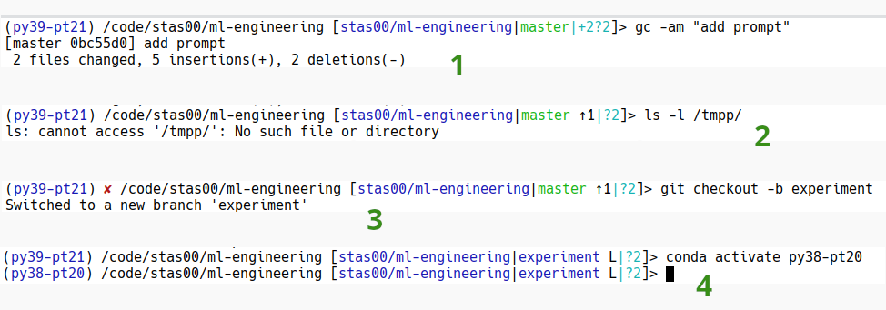

# Debugging Unix Tools


## Terminal

### Searching terminal's output

Teeing all outputs to `| tee -a log` allows you to later search the outputs, but there are times when you want to search the outputs dumped to the terminal. Therefore it's critical to use a terminal (console) that allows you to search it.

For example, in `konsole` this is `Ctrl-Shift-f`, and it provides a rich searching functionality - normal/regex/highlighting matching/search direction.

To be able to use search when there is a lot of output you want to make sure that your scrollback buffer (i.e. how many lines the terminal shows before it truncates) to a large number - e.g. I have mine set to 20k lines.

Since multiple runs of the same program may produce different outputs it may be confusing to search the terminal outputs since it's hard to tell which is which. In this situation, I call `clear` which clears all outputs in the terminal, before invoking a new command. So that my debug cycle looks like:

```
clear; ./myprogram --args ...
```
So that it's atomic and I never forget to clear the screen. Then the searchable output is always of the last run.

At other times I don't `clear`, since I do want to search previous results.


## Bash


While the instructions use Bash If you use a different shell a lot of the suggestions will be quite similar with small variations for some settings being different, but the key here is to grasp the concepts and then translate them to the other shell's environment.


### Controlling script execution

TLDR: Most of the time it's the best to start Bash scripts with:

```
#!/bin/bash
set -euo pipefail
# the rest of the script here
```
where the flags are:
- `set -e` instructs Bash to immediately exit if any command has a non-zero exit status.
- `set -u` instructs Bash to immediately exit if any undefined variable is used (exceptions: `$*` and `$@`)
- `set -o pipefail` - if any command in a pipeline fails, that return code will be used as the return code of the whole pipeline and not the status of the last command.

and if you want to see what the script is doing:
- `set -x` instructs Bash to print out each command it runs with its values

```
#!/bin/bash
set -x
# the rest of the script here
```
The following sections will explain each of these options.

#### Trace the execution to see commands and values

Here is a small bash script `test.sh` that does a few assignments and uses sleep to emulate a slow process:
```
$ cat << "EOT" > test.sh
#!/bin/bash
set -x
x=5
y=$(($x+5))
sleep 5
EOT
```

If you run it:
```
$ bash ./test.sh
```
you have no idea what it is doing.

Let's turn the execution tracer on by adding `set -x`:

```
$ cat << "EOT" > test.sh
#!/bin/bash
set -x
x=
y=$(($x+5))
sleep 5
EOT
```

If you run it:
```
$ bash ./test.sh
+ x=5
+ y=10
+ sleep 5
```
you can now see exactly what it is doing, it'll show every command before it's running it.

Additionally, you can see the values as they get modified. e.g. here we got to see that `y=x+5` resulted in 10. Which is super useful for debugging since you can actually see what the values are. Let's say `x` didn't get set for whatever reason:
```
$ cat << "EOT" > test.sh
#!/bin/bash
set -x
x=
y=$(($x+5))
EOT
```

If you run it:
```
$ bash ./test.sh
+ x=
+ y=5
```
you can instantly see that something is wrong with `x`.


#### Abort on failures inside the script

By default Bash scripts will ignore intermediary command failures and will continue the execution, which most of the time is not what you want.

Here is a small bash script `test.sh` that has a typo in the `echo` command
```
$ cat << EOT > test.sh
#!/bin/bash
echooo "is this working"
echo "all is good"
EOT
```

Let's run it:
```
$ bash ./test.sh
./test.sh: line 2: echooo: command not found
all is good
```

So despite, `echooo` command failing, the script continues. Additionally if we check the exit code of this run:

```
$ echo $?
0
```

It indicates to the caller that the script finished successfully, when it didn't.

Let's fix that by adding: `set -e` which will now abort the execution of the script on the first error:
```
$ cat << EOT > test.sh
#!/bin/bash
set -e
echooo "is this working"
echo "all is good"
EOT
```


Let's run it:
```
$ bash ./test.sh
./test.sh: line 2: echooo: command not found
```

As you can see the script exited at the point of failure. And if we check the exit code of this run:

```
$ echo $?
127
```

So not only we got the correct exit code to the caller, we can sometimes even interpret what the failure type it was.

The possible exit codes are listed [here](https://tldp.org/LDP/abs/html/exitcodes.html). and `127` corresponds to "command not found" error - which is indeed the case here. Though most of the time the time the exit code will be `1`, which is a catch all, unless the user took care to set a custom exit code.


#### Abort on failures in the pipeline

By default Bash scripts will ignore intermediary stage failures in the pipe `|` commands and will continue the execution, which again most of the time is not what you want.

```
$ cat << EOT > test.sh
#!/bin/bash
set -e
echooo "is this working" | sort
echo "all is good"
EOT
```

Let's run it:
```
$ bash ./test.sh
./test.sh: line 3: echooo: command not found
all is good
```

So despite, `echooo` command failing, the script continues. Additionally if we check the exit code of this run:

```
$ echo $?
0
```

But wait a second, didn't the previous section explain that setting `set -e` should abort the script at the first problem and set `$?` to a non-0 state?

The problem is the `|` pipe. Since `sort` is successful it masks the failure and bash isn't the wiser that something has failed.

So we also have to add `set -o pipefail` for this to do what I mean:

```
$ cat << EOT > test.sh
#!/bin/bash
set -eo pipefail
echooo "is this working" | sort
echo "all is good"
EOT
```

Let's run it:
```
$ bash ./test.sh
./test.sh: line 3: echooo: command not found
```
So we can see that the program aborted at the broken command

```
$ echo $?
127
```
and the exit code is again non-0.


#### Abort on undefined variables

By default Bash scripts will ignore undefined variables used to construct new variables:
```
$ cat << "EOT" > test.sh
#!/bin/bash
x="xxx"
y="yyy"
z="$X $y"
echo $z
EOT
```

We hope to get the output of `xxx yyy` as the value of `$z`.

Let's run it:
```
$ bash ./test.sh
yyy
```

If you haven't noticed I made an intentional mistake replacing `$x` with `$X`. You can see the former being defined, but not the latter. Yet, the program runs without errors and generates a non-intended output `yyy`.

If we add `set -u` now Bash will be strict about all variables needing to be defined before they can be used.
```
$ cat << "EOT" > test.sh
#!/bin/bash
set -u
x="xxx"
y="yyy"
z="$X $y"
echo $z
EOT
```

Let's run it:
```
$ bash ./test.sh
./test.sh: line 5: X: unbound variable
```
So we can see that the program aborted at line 5 `z="$X $y"` since `$X` is indeed undefined.

I thought it'd work for using `eval` to do math as well, but the `eval` seems to run in its own space where `set -u` couldn't reach. i.e. this code doesn't fail:
```
set -u
x=
y=$(($x+5))
echo y=$y
```


#### Temporarily turning off set commands

Once any of the `set` commands have been enabled if you have an area where you need to disable the guards, you simply use the `set +` setting, for example, let's demo with `set -e`:

```
$ cat << EOT > test.sh
#!/bin/bash
set -e
# failing is not ok
echo "prep"
set +e
# failing is ok
echooo "is this working"
set -e
# failing is again not ok
echooo "is this working 2"
echo "all is good"
EOT
```

Let's run it:
```
$ bash ./test.sh
prep
./test.sh: line 5: echooo: command not found
./test.sh: line 7: echooo: command not found
```

As you can see the broken command on line 5 didn't abort the script, due to `set +e`, but the one at line 7 did, due to `set -e`.


### Being able to copy-n-paste multi-lines

At times I copy-n-paste multiple commands that include new line separators. I wanted this to work correctly and therefore I have this in my `~/.inputrc`:
```
set enable-bracketed-paste Off
```

This setting allows new line copied with the command being pasted instead of making them disappear. You need to restart `bash` for this setting to take an effect.

footnote: `man bash` for more information and if you're using a different shell check its manpage for the equivalent setting.


### Informative prompt

Having a powerful shell prompt is extremely useful for quick debugging. You're certainly used to the `user@host /some/path/`, but it can do so much more.

Anything that has to do with the current status is very helpful. If you work with git a lot and have to switch back and forth between different branches and forks. A tool like [bash-git-prompt](https://github.com/magicmonty/bash-git-prompt) is insanely useful.

I have conda env display as part of it. And another useful feature that can be added is to show an indication when the last command failed, luckily `bash-git-prompt` already contains it.

Here is a snapshot of a few commands with `bash-git-prompt` activated:



I split it up into several steps that I numbered on snapshot.

1. you can see it tells me which conda env I'm in (`py39-pt21`), then the usual path, followed by git information. At this stage it tells me that I'm inside `stas00/ml-engineering` repo and that I'm on `master` branch and that I have 2 files not under git.

2. I have just committed something and you can immediately see `↑1` indicator telling me that I have one commit that is waiting to be pushed - so now I don't forget to push!

   I now I perform a command that failed, sometimes it's important to see that it failed when there is no obvious failure reported, so you can see it has a red `✘` showing up in the next prompt (stage 3).

3. Now I make a new branch and you can see that in stage 4, the prompt is updated to reflect that new branch.

4. finally I change conda envs and you can see that it now tells me which conda env I have activated

If for example I have to do git-bisect or switch to a specific git SHA, it'll show it as the current branch. So I'm never confused and need to type commands to figure where I am.

`bash-git-prompt` has many other goodies that show up when you merge, have conflicts, etc.

Now, there are other excellent power prompt tools out there. The key is to find one that will empower your work and make it less error-prone.

If you want to try my customized setup:

```
cd ~
git clone https://github.com/magicmonty/bash-git-prompt ~/.bash-git-prompt --depth=1
cd ~/.bash-git-prompt/themes
wget https://raw.githubusercontent.com/stas00/the-art-of-debugging/master/unix/bash-git-prompt/Stas.bgptheme
```
You way want to inspect [Stas.bgptheme](bash-git-prompt/Stas.bgptheme) first to see that I'm not injecting something into your environment.

and when you're happy add this to your `~/.bashrc`:
```
if [ -f "$HOME/.bash-git-prompt/gitprompt.sh" ]; then
    export GIT_PROMPT_ONLY_IN_REPO=0;
    export GIT_PROMPT_THEME="Stas"
    source "$HOME/.bash-git-prompt/gitprompt.sh"
fi
```
and start a new Bash. Remove the line with "Stas" if you want to use the default theme instead.


### strace

(note-to-self: the true source of this is https://github.com/stas00/ml-engineering/blob/master/debug/pytorch.md#strace)

`strace` is a super-useful tool which traces any running application at the low-level system calls - e.g. `libC` and alike.

For example, run:
```
strace python -c "print('strace')"
```
and you will see everything that is done at the system call level as the above program runs.

But usually it's more useful when you have a stuck program that spins all CPU cores at 100% but nothing happens and you want to see what's it doing. In this situation you simply attached to the running program like so:

```
strace --pid PID
```
where you get the PID for example from the output of `top` or `ps`. Typically I just copy-n-paste the PID of the program that consumes the most CPU - `top` usually shows it at the very top of its listing.

Same as `py-spy` you may need `sudo` perms to attached to an already running process - it all depends on your system setup. But you can always start a program with `strace` as I have shown in the original example.

Let's look at a small sub-snippet of the output of `strace python -c "print('strace')"`

```
write(1, "strace\n", 7strace
)                 = 7
```
Here we can see that a write call was executed on filedescriptor `1`, which almost always is `stdout` (`stdin` being 0, and `stderr` being 2).

If you're not sure what a filedescriptor is pointing to, normally you can tell from `strace`'s output itself. But you can also do:

```
ls -l /proc/PID/fd
```
where PID is the pid of the currently running program you're trying to investigate.

For example, when I run the above while running a pytest test with gpus, I got (partial output):
```
l-wx------ 1 stas stas 64 Mar  1 17:22 5 -> /dev/null
lr-x------ 1 stas stas 64 Mar  1 17:22 6 -> /dev/urandom
lrwx------ 1 stas stas 64 Mar  1 17:22 7 -> /dev/nvidiactl
lrwx------ 1 stas stas 64 Mar  1 17:22 8 -> /dev/nvidia0
lr-x------ 1 stas stas 64 Mar  1 17:22 9 -> /dev/nvidia-caps/nvidia-cap2
```
so you can see that a device `/dev/null` is open as FD (file descriptor) 5, `/dev/urandom` as FD 6, etc.

Now let's go look at another snippet from our `strace` run.

```
access("/etc/ld.so.preload", R_OK)      = -1 ENOENT (No such file or directory)
```
Here it tried to see if file `/etc/ld.so.preload` exists, but as we can see it doesn't - this can be useful if some shared library is missing - you can see where it's trying to load it from.

Let's try another one:
```
openat(AT_FDCWD, "/lib/x86_64-linux-gnu/libpthread.so.0", O_RDONLY|O_CLOEXEC) = 3
read(3, "\177ELF\2\1\1\0\0\0\0\0\0\0\0\0\3\0>\0\1\0\0\0\0\0\0\0\0\0\0\0"..., 832) = 832
newfstatat(3, "", {st_mode=S_IFREG|0644, st_size=21448, ...}, AT_EMPTY_PATH) = 0
mmap(NULL, 16424, PROT_READ, MAP_PRIVATE|MAP_DENYWRITE, 3, 0) = 0x7f8028807000
mmap(0x7f8028808000, 4096, PROT_READ|PROT_EXEC, MAP_PRIVATE|MAP_FIXED|MAP_DENYWRITE, 3, 0x1000) = 0x7f8028808000
mmap(0x7f8028809000, 4096, PROT_READ, MAP_PRIVATE|MAP_FIXED|MAP_DENYWRITE, 3, 0x2000) = 0x7f8028809000
mmap(0x7f802880a000, 8192, PROT_READ|PROT_WRITE, MAP_PRIVATE|MAP_FIXED|MAP_DENYWRITE, 3, 0x2000) = 0x7f802880a000
close(3)
```
here we can see that it opens `/lib/x86_64-linux-gnu/libpthread.so.0` and assigns it FD 3, it then reads 832 chars from FD 3, (we can also see that the first chars are ELF - which stands for a shared library format), then memory maps it and closes that file.

In this following example, we see a python cached file is opened, its filepointer is moved to 0, and then it's read and closed.
```
openat(AT_FDCWD, "/home/stas/anaconda3/envs/py38-pt113/lib/python3.8/__pycache__/abc.cpython-38.pyc", O_RDONLY|O_CLOEXEC) = 3
fstat(3, {st_mode=S_IFREG|0664, st_size=5329, ...}) = 0
lseek(3, 0, SEEK_CUR)                   = 0
lseek(3, 0, SEEK_CUR)                   = 0
fstat(3, {st_mode=S_IFREG|0664, st_size=5329, ...}) = 0
brk(0x23bf000)                          = 0x23bf000
read(3, "U\r\r\n\0\0\0\0\24\216\177c\211\21\0\0\343\0\0\0\0\0\0\0\0\0\0\0\0\0\0\0"..., 5330) = 5329
read(3, "", 1)                          = 0
close(3)
```
It's important to notice that file descriptors are re-used, so we have seen the same FD 3 twice, but each time it was open to a different file.

If your program is for example trying to reach to the Internet, you can also tell these calls from `strace` as the program would be reading from a socket file descriptor.

So let's run an example on a program that downloads files from the HF hub:
```
strace python -c 'import sys; from transformers import AutoConfig; AutoConfig.from_pretrained(sys.argv[1])' t5-small
```

here is some relevant to this discussion snippet:
```
socket(AF_INET6, SOCK_STREAM|SOCK_CLOEXEC, IPPROTO_TCP) = 3
setsockopt(3, SOL_TCP, TCP_NODELAY, [1], 4) = 0
ioctl(3, FIONBIO, [1])                  = 0
connect(3, {sa_family=AF_INET6, sin6_port=htons(443), sin6_flowinfo=htonl(0), inet_pton(AF_INET6, "2600:1f18:147f:e850:e203:c458:10cd:fc3c
", &sin6_addr), sin6_scope_id=0}, 28) = -1 EINPROGRESS (Operation now in progress)
poll([{fd=3, events=POLLOUT|POLLERR}], 1, 10000) = 1 ([{fd=3, revents=POLLOUT}])
getsockopt(3, SOL_SOCKET, SO_ERROR, [0], [4]) = 0
[...]
write(3, "\26\3\3\0F\20\0\0BA\4\373m\244\16\354/\334\205\361j\225\356\202m*\305\332\275\251\17J"..., 126) = 126
read(3, 0x2f05c13, 5)                   = -1 EAGAIN (Resource temporarily unavailable)
poll([{fd=3, events=POLLIN}], 1, 9903)  = 1 ([{fd=3, revents=POLLIN}])
read(3, "\24\3\3\0\1", 5)               = 5
read(3, "\1", 1)                        = 1
read(3, "\26\3\3\0(", 5)                = 5
read(3, "\0\0\0\0\0\0\0\0\344\v\273\225`\4\24m\234~\371\332%l\364\254\34\3472<\0356s\313"..., 40) = 40
ioctl(3, FIONBIO, [1])                  = 0
poll([{fd=3, events=POLLOUT}], 1, 10000) = 1 ([{fd=3, revents=POLLOUT}])
write(3, "\27\3\3\1.\0\374$\361\217\337\377\264g\215\364\345\256\260\211$\326pkR\345\276,\321\221`-"..., 307) = 307
ioctl(3, FIONBIO, [1])                  = 0
read(3, 0x2ef7283, 5)                   = -1 EAGAIN (Resource temporarily unavailable)
poll([{fd=3, events=POLLIN}], 1, 10000) = 1 ([{fd=3, revents=POLLIN}])
```

You can see where that again it uses FD 3 but this time it opens a INET6 socket instead of a file. You can see that it then connects to that socket, polls, reads and writes from it.

There are many other super useful understandings one can derive from using this tool.

BTW, if you don't want to scroll up-down, you can also save the output to a file:
```
strace -o strace.txt python -c "print('strace')"
```

Now, since you're might want to strace the program from the very beginning, for example to sort out some race condition on a distributed filesystem, you will want to tell it to follow any forked processes. This what the `-f` flag is for:


```
strace -o log.txt -f python -m torch.distributed.run --nproc_per_node=4 --nnodes=1 --tee 3 test.py
```

So here we launch 4 processes and will end up running `strace` on at least 5 of them - the launcher plus 4 processes (each of which may spawn further child processes).

It will conveniently prefix each line with the pid of the program so it should be easy to tell which system was made by which process.

But if you want separate logs per process, then use `-ff` instead of `-f`.

The `strace` manpage has a ton of other useful options.
