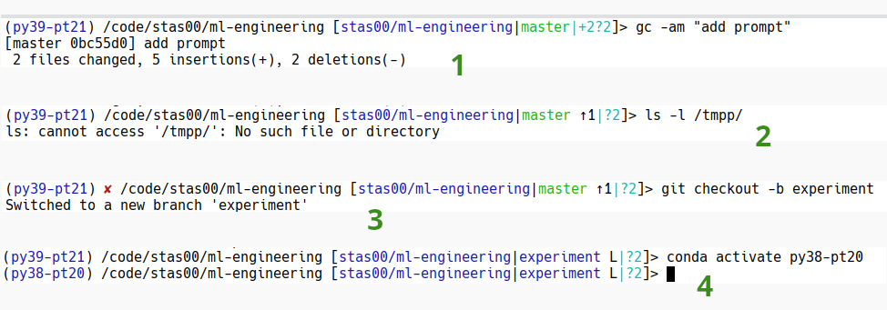

# Unix Tools for Debugging

## Shell environment

### Terminal

#### Searching terminal's output

Teeing all outputs to `| tee -a log` allows you to later search the outputs, but there are times when you want to search the outputs dumped to the terminal. Therefore it's critical to use a terminal (console) that allows you to search it.

For example, in `konsole` this is `Ctrl-Shift-f`, and it provides a rich searching functionality - normal/regex/highlighting matching/search direction.

To be able to use search when there is a lot of output you want to make sure that your scrollback buffer (i.e. how many lines the terminal shows before it truncates it) is set to a large number - e.g. I have mine set to 20k lines.

If you use [`tmux`](https://github.com/tmux/tmux) `Ctrl-b->[` will enter scrollback mode, and vi/emacs (depending on your settings) keys can be used for search/scroll/etc.

Since multiple runs of the same program may produce different outputs it may be confusing to search the terminal outputs since it's hard to tell which is which. In this situation, I call `clear` which clears all outputs in the terminal, before invoking a new command. So that my debug cycle looks like:

```bash
clear; ./myprogram --args ...
```
So that it's atomic and I never forget to clear the screen. Then the searchable output is always of the last run.

At other times I don't `clear`, since I do want to search previous results.


#### Being able to copy-n-paste multi-lines

At times I copy-n-paste multiple commands that include new line separators. I wanted this to work correctly and therefore I have this in my `~/.inputrc`:
```bash
set enable-bracketed-paste Off
```

This setting allows new line copied with the command being pasted instead of making them disappear. You need to restart `bash` for this setting to take an effect.

footnote: `man bash` for more information and if you're using a different shell check its manpage for the equivalent setting.

### Informative prompt

Having a powerful shell prompt is extremely useful for quick debugging. You're certainly used to the `user@host /some/path/`, but it can do so much more.

Anything that has to do with the current status is very helpful. If you work with git a lot and have to switch back and forth between different branches and forks. A tool like [bash-git-prompt](https://github.com/magicmonty/bash-git-prompt) is insanely useful.

I have conda env display as part of it. And another useful feature that can be added is to show an indication when the last command failed, luckily `bash-git-prompt` already contains it.

Here is a snapshot of a few commands with `bash-git-prompt` activated:



I split it up into several stages that I numbered on the snapshot.

1. you can see it tells me which conda env I'm in (`py39-pt21`), then the usual path, followed by git information. At this stage it tells me that I'm inside `stas00/ml-engineering` repo and that I'm on `master` branch and that I have 2 files not under git.

2. I have just committed something and you can immediately see `↑1` indicator telling me that I have one commit that is waiting to be pushed - so now I don't forget to push!

3. I now perform a command that failed - sometimes it's important to see that it failed when there is no obvious failure reported, so you can see it has a red `✘` showing up in this prompt.

4. Now I make a new branch and you can see that the prompt is updated to reflect that new branch.

5. finally I change conda envs and you can see that it now tells me which conda env I have activated

If for example I have to do git-bisect or switch to a specific git SHA, it'll show it as the current branch. So I'm never confused and need to type commands to figure where I am.

`bash-git-prompt` has many other goodies that show up when you merge, have conflicts, etc.

Now, there are other excellent power prompt tools out there. The key is to find one that will empower your work and make it less error-prone.

If you want to try my customized setup:

```bash
cd ~
git clone https://github.com/magicmonty/bash-git-prompt ~/.bash-git-prompt --depth=1
cd ~/.bash-git-prompt/themes
wget https://raw.githubusercontent.com/stas00/the-art-of-debugging/master/unix/bash-git-prompt/Stas.bgptheme
```
You way want to inspect [Stas.bgptheme](bash-git-prompt/Stas.bgptheme) first to see that I'm not injecting something into your environment.

and when you're happy add this to your `~/.bashrc`:
```bash
if [ -f "$HOME/.bash-git-prompt/gitprompt.sh" ]; then
    export GIT_PROMPT_ONLY_IN_REPO=0;
    export GIT_PROMPT_THEME="Stas"
    source "$HOME/.bash-git-prompt/gitprompt.sh"
fi
```
and start a new Bash. Remove the line with "Stas" if you want to use the default theme instead.

## Bash


While the instructions use Bash If you use a different shell a lot of the suggestions will be quite similar with small variations for some settings being different, but the key here is to grasp the concepts and then translate them to the other shell's environment.


### Controlling script execution

tldr: Most of the time it's the best to start Bash scripts with:

```bash
#!/bin/bash
set -euo pipefail
# the rest of the script here
```
where the flags are:
- `set -e` instructs Bash to immediately exit if any command has a non-zero exit status.
- `set -u` instructs Bash to immediately exit if any undefined variable is used (exceptions: `$*` and `$@`)
- `set -o pipefail` - if any command in a pipeline fails, that return code will be used as the return code of the whole pipeline and not the status of the last command.

and if you want to see what the script is doing:
- `set -x` instructs Bash to print out each command it runs with its values

```bash
#!/bin/bash
set -x
# the rest of the script here
```
The following sections will explain each of these options.

#### Trace the execution to see commands and values

Here is a small bash script `test.sh` that does a few assignments and uses sleep to emulate a slow process:
```bash
$ cat << "EOT" > test.sh
#!/bin/bash
x=5
y=$(($x+5))
sleep 5
EOT
```

If you run it:
```bash
$ bash ./test.sh
```
you have no idea what it is doing.

Let's turn the execution tracer on by adding `set -x`:

```bash
$ cat << "EOT" > test.sh
#!/bin/bash
set -x
x=5
y=$(($x+5))
sleep 5
EOT
```

If you run it:
```bash
$ bash ./test.sh
+ x=5
+ y=10
+ sleep 5
```
you can now see exactly what it is doing, it'll show every command before it's running it.

Additionally, you can see the values as they get modified. e.g. here we got to see that `y=x+5` resulted in 10. Which is super useful for debugging since you can actually see what the values are. Let's say `x` didn't get set for whatever reason:
```bash
$ cat << "EOT" > test.sh
#!/bin/bash
set -x
x=
y=$(($x+5))
EOT
```

If you run it:
```bash
$ bash ./test.sh
+ x=
+ y=5
```
you can instantly see that something is wrong with `x`.


#### Abort on failures inside the script

By default Bash scripts will ignore intermediary command failures and will continue the execution, which most of the time is not what you want.

Here is a small bash script `test.sh` that has a typo in the `echo` command
```bash
$ cat << EOT > test.sh
#!/bin/bash
echooo "is this working"
echo "all is good"
EOT
```

Let's run it:
```bash
$ bash ./test.sh
./test.sh: line 2: echooo: command not found
all is good
```

So despite, `echooo` command failing, the script continues. Additionally if we check the exit code of this run:

```bash
$ echo $?
0
```

It indicates to the caller that the script finished successfully, when it didn't.

Let's fix that by adding: `set -e` which will now abort the execution of the script on the first error:
```bash
$ cat << EOT > test.sh
#!/bin/bash
set -e
echooo "is this working"
echo "all is good"
EOT
```


Let's run it:
```bash
$ bash ./test.sh
./test.sh: line 2: echooo: command not found
```

As you can see the script exited at the point of failure. And if we check the exit code of this run:

```bash
$ echo $?
127
```

So not only we got the correct exit code to the caller, we can sometimes even interpret what the failure type it was.

The possible exit codes are listed [here](https://tldp.org/LDP/abs/html/exitcodes.html). and `127` corresponds to "command not found" error - which is indeed the case here. Though most of the time the exit code will be `1`, which is a catch all, unless the user took care to set a custom exit code.


#### Abort on failures in the pipeline

By default Bash scripts will ignore intermediary stage failures in the pipe `|` commands and will continue the execution, which again most of the time is not what you want.

```bash
$ cat << EOT > test.sh
#!/bin/bash
set -e
echooo "is this working" | sort
echo "all is good"
EOT
```

Let's run it:
```bash
$ bash ./test.sh
./test.sh: line 3: echooo: command not found
all is good
```

So despite, `echooo` command failing, the script continues. Additionally if we check the exit code of this run:

```bash
$ echo $?
0
```

But wait a second, didn't the previous section explain that setting `set -e` should abort the script at the first problem and set `$?` to a non-0 state?

The problem is the `|` pipe. Since `sort` is successful it masks the failure and bash isn't the wiser that something has failed.

So we also have to add `set -o pipefail` for this to do what I mean:

```bash
$ cat << EOT > test.sh
#!/bin/bash
set -eo pipefail
echooo "is this working" | sort
echo "all is good"
EOT
```

Let's run it:
```bash
$ bash ./test.sh
./test.sh: line 3: echooo: command not found
```
So we can see that the program aborted at the broken command

```bash
$ echo $?
127
```
and the exit code is again non-0.


#### Abort on undefined variables

By default Bash scripts will ignore undefined variables used to construct new variables:
```bash
$ cat << "EOT" > test.sh
#!/bin/bash
x="xxx"
y="yyy"
z="$X $y"
echo $z
EOT
```

We hope to get the output of `xxx yyy` as the value of `$z`.

Let's run it:
```bash
$ bash ./test.sh
yyy
```

If you haven't noticed I made an intentional mistake replacing `$x` with `$X`. You can see the former being defined, but not the latter. Yet, the program runs without errors and generates a non-intended output `yyy`.

If we add `set -u` now Bash will be strict about all variables needing to be defined before they can be used.
```bash
$ cat << "EOT" > test.sh
#!/bin/bash
set -u
x="xxx"
y="yyy"
z="$X $y"
echo $z
EOT
```

Let's run it:
```bash
$ bash ./test.sh
./test.sh: line 5: X: unbound variable
```
So we can see that the program aborted at line 5 `z="$X $y"` since `$X` is indeed undefined.

I thought it'd work for using `eval` to do math as well, but the `eval` seems to run in its own space where `set -u` couldn't reach. i.e. this code doesn't fail:
```bash
set -u
x=
y=$(($x+5))
echo y=$y
```


#### Temporarily turning off set commands

Once any of the `set` commands have been enabled if you have an area where you need to disable the guards, you simply use the `set +` setting, for example, let's demo with `set -e`:

```bash
$ cat << EOT > test.sh
#!/bin/bash
set -e
# failing is not ok
echo "prep"
set +e
# failing is ok
echooo "is this working"
set -e
# failing is again not ok
echooo "is this working 2"
echo "all is good"
EOT
```

Let's run it:
```bash
$ bash ./test.sh
prep
./test.sh: line 5: echooo: command not found
./test.sh: line 7: echooo: command not found
```

As you can see the broken command on line 5 didn't abort the script, due to `set +e`, but the one at line 7 did, due to `set -e`.

## strace

`strace` is a super-useful tool which traces any running application at the low-level system calls - e.g. `libC` and alike.

It's covered in depth, with worked examples, in the PyTorch chapter - see [strace](../pytorch/README.md#strace). While the examples there use PyTorch, the tool and the techniques apply to any program.

## nohup

If you need to connect to a remote server launch a command and either logout or let the connection timeout, normally the command will get terminated upon exit.

`nohup` solves this problem. You just need to add `nohup` before the normal command:
```bash
nohup ./long-running-command &
```
and you can now safely logout and it'll continue to run until it runs its course.

any std streams will get saved in `nohup.out`, as `nohup` will pipe `stderr` into the `stdout` stream.

So you may want to redirect it to a log file of your liking:

```bash
nohup ./long-running-command > log.txt &
```

## make

`make` is probably one of the most used tools in the Unix world. Many software projects still use `Makefile` to run various commands. `Makefile` is used by `make` to guide it.

Debugging `Makefile` can be non-trivial as it's quite old and arcane, but chances are very high that you will run into troubleshooting it sooner or later.

In order that we have something to work with, let's take the `Makefile` from [ipyexperiments](https://github.com/stas00/ipyexperiments):
```bash
git clone https://github.com/stas00/ipyexperiments
cd ipyexperiments
cat Makefile
```

Unless you're using a modern editor that can automatically detect `Makefile` format and show you where the problems are, one of the main problems is that it requires hard tabs (`\t`) for its formatting. If you don't use hard tabs, you're likely to see something like:
```
Makefile:13: *** missing separator.  Stop.
```

You can ask `cat` to show you all the special characters:
```bash
$ cat -e -t -v Makefile
[...]
##@ Testing new package installation$
$
test-install: ## test conda/pip package by installing that version them$
^I@echo "\n\n*** Install/uninstall $(version) conda version"$
^I@# skip, throws error when uninstalled @conda uninstall -y ipyexperiments$
[...]
```
So it shows `$` for new line characters, and `^I` for hard tabs. If in that output of special `cat` flags you see something like:
```
test-install: ## test conda/pip package by installing that version them$
        @echo "\n\n*** Install/uninstall $(version) conda version"$
        @# skip, throws error when uninstalled @conda uninstall -y ipyexperiments$
```
this is broken, as you have white-spaces and not a real tab. The previous output is the valid one.

One useful flag is `-n`:
```bash
make -n clean
```
as it shows you what would be run w/o running it, in case you need to be extra careful.

There is `-d` that is helpful when debugging compilation targets as it dumps a bunch of information about what it does. The less verbose `--debug=b` is probably more practical. `--trace` is in the same category of being verbose with regards to what targets are being rebuilt.

`make -j` will run multiple jobs in parallel. I mention it here in debug section because if the dependencies aren't set correctly `make` might work, but `make -j` might fail, since it may try to build an object that depends on another object that hasn't yet been built. So if someone's build fails with `make -j` try w/o `-j` first. Also it's usually better to specify an actual number of parallel jobs to run, as in `make -j 8`. If you don't specify the number it'll default to the number of cpu cores on your system. And if you have a lot of cores it could be too much for your machine as it'll also create a huge amount of IO.

If you run a complex multi-dir `make`, adding `-w` is useful as it'll log every time it changes a directory.

This is probably the least interesting section of this guide, but it is what it is. For more information please see [GNU make](https://www.gnu.org/software/make/manual/make.html).
